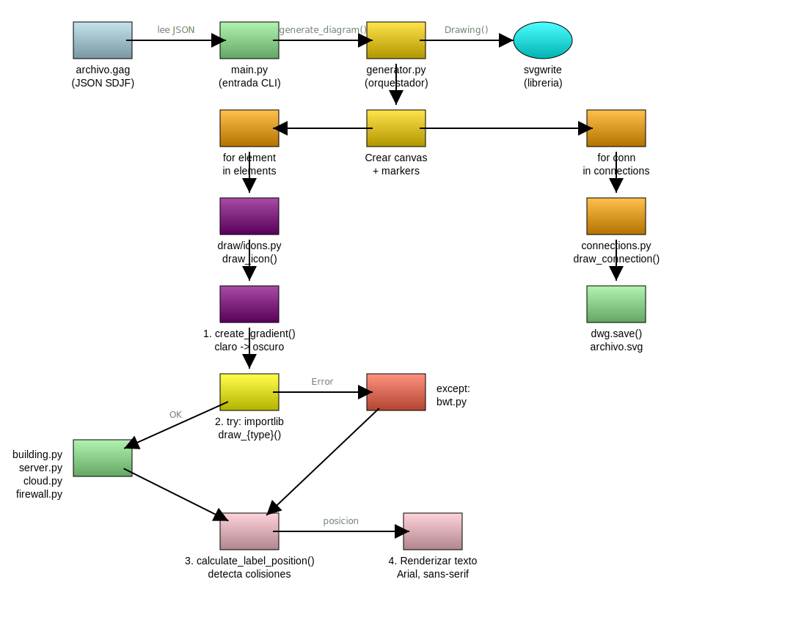

# AlmaGag - Generador Automático de Grafos

**Proyecto**: ALMA (Almas y Sentidos)
**Módulo**: GAG - Intérprete de sentidos para Funes
**Versión**: v2.1 + SDJF v2.1

---

AlmaGag es un generador de diagramas SVG que transforma archivos JSON (formato SDJF) en gráficos vectoriales mediante auto-layout inteligente.

## 🚀 Inicio Rápido

### Instalación

```bash
cd AlmaGag
pip install -e .
```

### Uso

```bash
almagag mi-diagrama.gag
```

### Ejemplo Mínimo

Crear `ejemplo.gag`:

```json
{
  "elements": [
    {
      "id": "api",
      "type": "server",
      "label": "REST API",
      "label_priority": "high",
      "hp": 2.0,
      "color": "gold"
    },
    {
      "id": "db",
      "type": "building",
      "label": "Database",
      "label_priority": "high",
      "hp": 1.8,
      "color": "orange"
    },
    {
      "id": "cache",
      "type": "cloud",
      "label": "Redis",
      "color": "cyan"
    }
  ],
  "connections": [
    {
      "from": "api",
      "to": "db",
      "routing": {"type": "orthogonal"},
      "label": "SQL",
      "direction": "forward"
    },
    {
      "from": "api",
      "to": "cache",
      "routing": {"type": "bezier", "curvature": 0.5},
      "label": "get/set",
      "direction": "bidirectional"
    }
  ]
}
```

Generar:

```bash
almagag ejemplo.gag
```

**Resultado**: `ejemplo.svg` con auto-layout inteligente, sin coordenadas manuales.

---

## ✨ Características Principales

### SDJF v2.1 ✨ NUEVO

- **✅ Routing Declarativo**: 5 tipos de líneas sin waypoints manuales
  - `straight`: Líneas rectas (default)
  - `orthogonal`: Líneas H-V o V-H (arquitectura)
  - `bezier`: Curvas suaves (flujos)
  - `arc`: Arcos circulares (self-loops)
  - `manual`: Waypoints explícitos (v1.5 compatible)
- **✅ Auto-waypoints**: Calculados automáticamente después de posicionamiento
- **✅ Corner Radius**: Esquinas redondeadas preparadas

### SDJF v2.0

- **✅ Coordenadas Opcionales**: Auto-layout calcula posiciones automáticamente
- **✅ Sizing Proporcional**: `hp` y `wp` para escalar elementos
- **✅ Prioridades Inteligentes**: HIGH → centro, NORMAL → alrededor, LOW → periferia
- **✅ Weight-Based Optimization**: Elementos grandes resisten movimiento

### SDJF v1.5

- **✅ Contenedores**: Agrupación visual de elementos con `contains`

### SDJF v1.0

- **✅ 4 Tipos de Íconos**: server, building, cloud, firewall
- **✅ Gradientes Automáticos**: Colores CSS y hexadecimales
- **✅ 4 Direcciones de Flechas**: forward, backward, bidirectional, none
- **✅ Fallback BWT**: Banana With Tape para tipos desconocidos

---

## 📖 Documentación Completa

### Especificaciones del Estándar SDJF

- **[SDJF v1.0](docs/spec/SDJF_v1.0_SPEC.md)** - Especificación base
- **[SDJF v2.0](docs/spec/SDJF_v2.0_SPEC.md)** - Coordenadas opcionales + Sizing proporcional
- **[SDJF v2.1](docs/spec/SDJF_v2.1_PROPOSAL.md)** - ✅ Routing declarativo + Waypoints automáticos

### Guías de Uso

- **[Quickstart](docs/guides/QUICKSTART.md)** - Instalación y primer diagrama
- **[Galería de Ejemplos](docs/guides/EXAMPLES.md)** - 10 ejemplos con explicaciones

### Arquitectura del Código

- **[Arquitectura](docs/architecture/ARCHITECTURE.md)** - Diseño modular y patrones
- **[Evolución](docs/architecture/EVOLUTION.md)** - Historia de versiones

---

## 🎨 Ejemplos

Ver carpeta [`docs/examples/`](docs/examples/) con 10 ejemplos `.gag` y sus SVGs generados:

| Ejemplo | Descripción |
|---------|-------------|
| 01-iconos-registrados | Tipos de íconos disponibles |
| 02-iconos-no-registrados | Fallback BWT |
| 03-conexiones | Direcciones de flechas |
| 04-gradientes-colores | Sistema de colores |
| 05-arquitectura-gag | Diagrama complejo (auto-documentación) |
| 06-waypoints | Routing con puntos intermedios |
| 07-containers | Contenedores y agrupación |
| 08-auto-layout | Auto-layout completo (sin coordenadas) |
| 09-proportional-sizing | Sizing proporcional (hp/wp) |
| 10-hybrid-layout | Híbrido: auto + manual + prioridades |

```bash
# Generar todos los ejemplos
almagag docs/examples/08-auto-layout.gag
almagag docs/examples/10-hybrid-layout.gag
```

---

## 🏗️ Arquitectura



**Flujo de ejecución:**

```
archivo.gag (JSON)
    ↓
main.py (CLI)
    ↓
generator.py (Orquestador)
    ├─ Layout (datos inmutables)
    ├─ AutoLayoutOptimizer v2.1
    │   ├─ Auto-positioning (v2.0)
    │   ├─ Graph analysis
    │   ├─ Collision detection
    │   └─ Iterative optimization
    ├─ SVG canvas + markers
    └─ Render (shapes → lines → labels)
    ↓
archivo.svg
```

**Módulos principales:**

- `layout/` - Layout inmutable + Optimización modular
- `routing/` - Sistema de routing declarativo (v2.1)
- `draw/` - Renderizado SVG (íconos, conexiones, contenedores)

Ver [documentación completa de arquitectura](docs/architecture/ARCHITECTURE.md).

---

## 🛠️ Desarrollo

### Estructura del Proyecto

```
AlmaGag/
├── main.py                   # CLI entry point
├── generator.py              # Orquestador
├── config.py                 # Constantes
├── layout/                   # Módulo de Layout (v2.1)
│   ├── layout.py             # Clase Layout (inmutable)
│   ├── auto_optimizer.py     # AutoLayoutOptimizer v2.1
│   ├── sizing.py             # SizingCalculator (v2.0)
│   ├── auto_positioner.py    # AutoLayoutPositioner (v2.0)
│   ├── geometry.py           # GeometryCalculator
│   ├── collision.py          # CollisionDetector
│   └── graph_analysis.py     # GraphAnalyzer
├── routing/                  # Sistema de routing (v2.1)
│   ├── router_base.py        # Base classes: ConnectionRouter, Path
│   ├── straight_router.py    # Líneas rectas
│   ├── orthogonal_router.py  # Líneas H-V/V-H
│   ├── bezier_router.py      # Curvas Bézier
│   ├── arc_router.py         # Arcos circulares
│   ├── manual_router.py      # Waypoints manuales (v1.5)
│   └── router_manager.py     # Coordinador de routers
├── draw/                     # Módulo de renderizado
│   ├── icons.py              # Dispatcher + gradientes
│   ├── connections.py        # Líneas + routing types (v2.1)
│   ├── container.py          # Contenedores (v1.5)
│   └── [server|building|cloud|firewall|bwt].py
└── docs/                     # Documentación organizada
    ├── spec/                 # Especificaciones SDJF
    ├── guides/               # Guías de uso
    ├── architecture/         # Arquitectura del código
    └── examples/             # Archivos .gag y .svg
```

### Extensibilidad

**Agregar nuevo tipo de ícono:**

1. Crear `draw/mi_icono.py`:

```python
from AlmaGag.config import ICON_WIDTH, ICON_HEIGHT
from AlmaGag.draw.icons import create_gradient

def draw_mi_icono(dwg, x, y, color, element_id):
    fill = create_gradient(dwg, element_id, color)
    dwg.add(dwg.circle(center=(x + ICON_WIDTH/2, y + ICON_HEIGHT/2),
                       r=25, fill=fill, stroke='black'))
```

2. Usar en SDJF:

```json
{
  "id": "elem1",
  "type": "mi_icono",
  "label": "Custom Icon"
}
```

No requiere modificar código existente (dynamic import).

---

## 🗺️ Roadmap

### ✅ v2.1 - Routing Declarativo (Implementado)

- **✅ Routing declarativo**: `{"routing": {"type": "orthogonal"}}`
- **✅ 5 tipos de líneas**: `straight`, `orthogonal`, `bezier`, `arc`, `manual`
- **✅ Auto-waypoints**: Calculados después de posicionamiento
- **✅ Corner radius**: Preparado (rendering básico)

Ver [especificación completa](docs/spec/SDJF_v2.1_PROPOSAL.md) y [resumen de implementación](SDJF_v2.1_IMPLEMENTATION_SUMMARY.md).

### v2.2 (Próximo) - Collision Avoidance

- **Avoid elements**: Routing inteligente evitando colisiones con A*
- **Corner radius avanzado**: SVG path smoothing completo
- **Smart routing**: Preferencias automáticas según tipos de elementos

### Futuro

- ~~Autolayout~~ ✅ Implementado v2.0
- ~~Routing declarativo~~ ✅ Implementado v2.1
- ~~Gradientes y sombras~~ ✅ Implementado v1.2
- Temas predefinidos (Cloud, Tech, Minimal)
- Animación SVG (timeline de aparición)
- Íconos SVG externos

---

## 📄 Licencia

[Especificar licencia aquí]

---

## 🤝 Contribuir

Este proyecto es parte de ALMA. Para reportar bugs o sugerir mejoras, abre un issue en el repositorio.

---

## 📚 Enlaces Rápidos

| Recurso | Enlace |
|---------|--------|
| Guía de inicio | [docs/guides/QUICKSTART.md](docs/guides/QUICKSTART.md) |
| Especificación v2.0 | [docs/spec/SDJF_v2.0_SPEC.md](docs/spec/SDJF_v2.0_SPEC.md) |
| Galería de ejemplos | [docs/guides/EXAMPLES.md](docs/guides/EXAMPLES.md) |
| Arquitectura | [docs/architecture/ARCHITECTURE.md](docs/architecture/ARCHITECTURE.md) |
| Propuesta v2.1 | [docs/spec/SDJF_v2.1_PROPOSAL.md](docs/spec/SDJF_v2.1_PROPOSAL.md) |

---

**AlmaGag** - Generación automática de diagramas con auto-layout inteligente y routing declarativo
Versión: v2.1 + SDJF v2.1 | Actualizado: 2026-01-08
