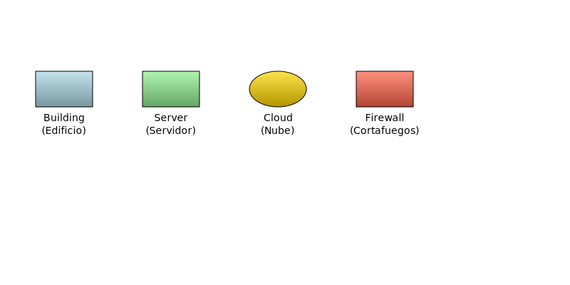
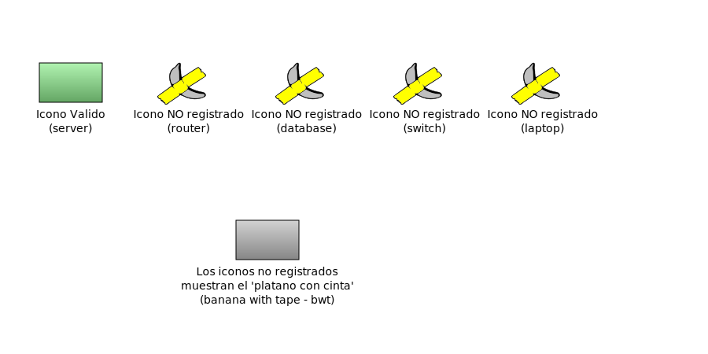
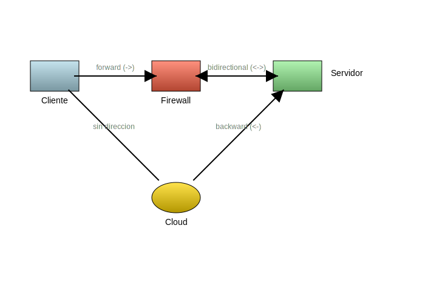
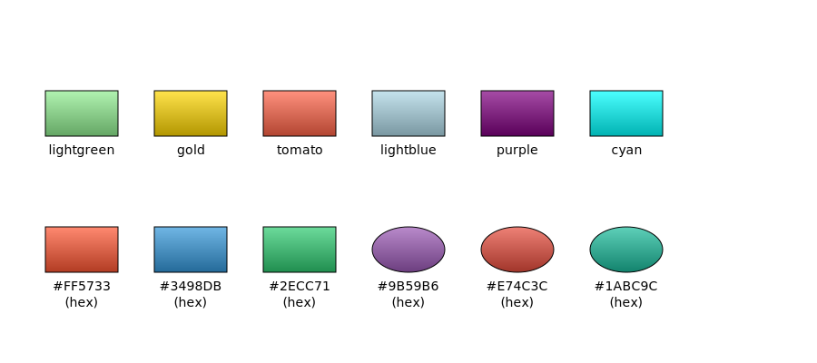

# GAG - Generador Automático de Grafos

**Proyecto:** ALMA (Almas y Sentidos)
**Módulo:** GAG - Intérprete de sentidos para Funes

GAG es una herramienta para generar diagramas SVG a partir de archivos JSON en formato SDJF (Simple Diagram JSON Format). Permite describir nodos, conexiones y sus relaciones visuales de forma declarativa.

## Instalación

Asegúrate de tener Python 3 instalado. Instala la dependencia `svgwrite`:

```bash
pip install svgwrite
```

O usando `requirements.txt`:

```bash
pip install -r requirements.txt
```

## Uso

Ejecuta GAG desde el directorio padre del proyecto con:

```bash
python -m AlmaGag.main archivo.gag
```

Esto genera un archivo SVG con el mismo nombre base en el directorio actual.

### Ejemplo:

```bash
python -m AlmaGag.main roadmap-25-06-22.gag
```

Genera: `roadmap-25-06-22.svg`

## Formato de entrada: SDJF v1.0

GAG utiliza archivos `.gag` que contienen JSON en formato SDJF. La estructura básica es:

```json
{
  "canvas": {
    "width": 1400,
    "height": 900
  },
  "elements": [
    {
      "id": "srv1",
      "type": "server",
      "x": 100,
      "y": 200,
      "label": "Servidor 1\n(Producción)",
      "color": "lightblue"
    }
  ],
  "connections": [
    {
      "from": "srv1",
      "to": "fw1",
      "label": "HTTPS",
      "direction": "forward"
    }
  ]
}
```

### Sección `canvas` (opcional)

Define el tamaño del SVG resultante:

- `width`: ancho en píxeles (default: 1400)
- `height`: alto en píxeles (default: 900)

### Sección `elements` (requerida)

Define los nodos del diagrama. Cada elemento debe tener:

- **`id`** (requerido): Identificador único
- **`x`, `y`** (requerido): Coordenadas top-left del ícono en píxeles
- **`type`** (opcional): Tipo de ícono a dibujar
  - Tipos disponibles: `server`, `firewall`, `building`, `cloud`
  - Si el tipo no existe o no se especifica, se dibuja un **plátano con cinta** (BWT) como fallback de ambigüedad
- **`label`** (opcional): Texto debajo del ícono. Soporta saltos de línea con `\n`
- **`color`** (opcional): Color de relleno del ícono (default: `gray`)

### Sección `connections` (requerida)

Define las aristas del diagrama. Cada conexión puede tener:

- **`from`** (requerido): ID del nodo origen
- **`to`** (requerido): ID del nodo destino
- **`label`** (opcional): Texto en el centro de la línea
- **`direction`** (opcional): Dirección de la flecha
  - `forward`: flecha al final (A → B)
  - `backward`: flecha al inicio (A ← B)
  - `bidirectional`: flechas en ambos extremos (A ↔ B)
  - `none`: sin flechas (default)
- **`relation`** (opcional): Tipo semántico de relación (decorativo en v1.0)

## Ejemplos incluidos

### roadmap-25-06-22.gag

Diagrama de roadmap de mejoras visuales:

```bash
python -m AlmaGag.main roadmap-25-06-22.gag
```

### data/primos.gag

Diagrama de flujo para calcular números primos:

```bash
python -m AlmaGag.main data/primos.gag
```

## Estructura del proyecto

```
AlmaGag/
├── main.py              # Punto de entrada
├── generator.py         # Lógica de generación SVG y markers de flechas
├── config.py            # Constantes (WIDTH, HEIGHT, ICON_WIDTH, etc.)
├── draw/
│   ├── __init__.py
│   ├── icons.py         # Lógica de dibujo de íconos y gradientes
│   ├── connections.py   # Lógica de conexiones con offset visual
│   ├── bwt.py           # Fallback: Banana With Tape
│   ├── server.py        # Ícono tipo server
│   ├── firewall.py      # Ícono tipo firewall
│   ├── building.py      # Ícono tipo building
│   └── cloud.py         # Ícono tipo cloud
└── docs/
    └── examples/        # Archivos de ejemplo .gag y .svg generados
        ├── 01-iconos-registrados.gag
        ├── 01-iconos-registrados.svg
        ├── 02-iconos-no-registrados.gag
        ├── 02-iconos-no-registrados.svg
        ├── 03-conexiones.gag
        ├── 03-conexiones.svg
        ├── 04-gradientes-colores.gag
        └── 04-gradientes-colores.svg
```

## Características de la v1.0

✅ Formato SDJF estándar con `elements` y `connections`
✅ Soporte de canvas personalizado
✅ Flechas direccionales (forward, backward, bidirectional, none)
✅ Sistema modular de íconos con importación dinámica
✅ Fallback BWT para tipos desconocidos (explícita ambigüedad)
✅ Etiquetas multilínea en elementos
✅ Codificación UTF-8 sin BOM

## Mejoras v1.1

✅ **Módulo `connections.py` separado**: Lógica de conexiones extraída a su propio módulo para mejor mantenibilidad
✅ **Offset visual en conexiones**: Las líneas de conexión ahora calculan un offset desde el centro del ícono para evitar superposición visual con los elementos. Diferentes tipos de íconos (como `cloud`) tienen offsets adaptados a su forma
✅ **Orden de renderizado optimizado**: Los íconos se dibujan primero y las conexiones después, asegurando que las flechas queden visualmente encima cuando corresponde

## Mejoras v1.2

✅ **Gradientes automáticos**: Los colores de los elementos ahora generan gradientes lineales automáticamente (de claro a oscuro), mejorando significativamente la apariencia visual
✅ **Soporte de colores CSS y hex**: Acepta tanto nombres de colores CSS (`lightgreen`, `gold`, `tomato`) como valores hexadecimales (`#FF5733`, `#3498DB`)
✅ **Documentación con ejemplos**: Nueva carpeta `docs/examples/` con archivos `.gag` de demostración y sus SVG generados

## Galería de ejemplos

### Íconos registrados con gradientes

Los tipos de íconos disponibles (`building`, `server`, `cloud`, `firewall`) se renderizan con gradientes automáticos basados en el color especificado:



### Fallback para íconos no registrados (BWT)

Cuando se solicita un tipo de ícono que no existe, el sistema muestra el **"Plátano con Cinta"** (Banana With Tape) como indicador visual de ambigüedad:



```
[WARN] No se pudo dibujar 'router', se usará ícono por defecto. Error: No module named 'AlmaGag.draw.router'
[WARN] No se pudo dibujar 'database', se usará ícono por defecto. Error: No module named 'AlmaGag.draw.database'
```

### Tipos de conexiones

Soporte para diferentes direcciones de flechas: `forward`, `backward`, `bidirectional` y `none`:



### Variedad de colores y gradientes

Demostración de gradientes automáticos con colores CSS nombrados y valores hexadecimales:



## Roadmap futuro

- **Autolayout**: Generación automática de coordenadas
- ~~**Gradientes y sombras**~~: ✅ Implementado en v1.2
- **Temas**: Estilos predefinidos (Cloud, Tech, Minimal)
- **Animación**: Timeline para aparición secuencial
- **Íconos SVG externos**: Soporte para iconografía personalizada

## Contribuir

Este proyecto es parte de ALMA. Para reportar bugs o sugerir mejoras, abre un issue en el repositorio.

## Licencia

[Especificar licencia aquí]
