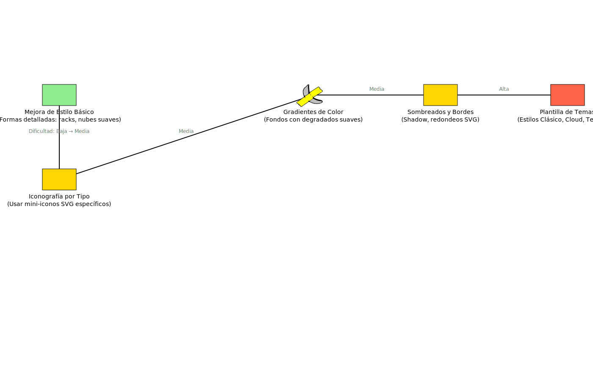

# SVG Diagram Generator

This repository contains `svg_diagram_generator.py`, a simple script that reads a JSON description of elements and their connections and produces an SVG diagram.

## Installation

Ensure you have Python 3 installed. Install the `svgwrite` dependency
directly:

```bash
pip install svgwrite
```

Or install using `requirements.txt`:

```bash
pip install -r requirements.txt
```

## JSON input format

The script expects a JSON file with two main arrays: `elements` and `connections`.

### `elements`
Each element describes a diagram icon and must include at least the following fields:

- `id`: unique identifier used to reference the element from `connections`.
- `x`, `y`: coordinates of the top-left corner of the icon within the canvas.
- `label`: text displayed below the icon. You may include `\n` for multi-line labels.
- `type` *(optional)*: one of `server`, `firewall`, `building`, `cloud`. An unknown type results in a banana-with-tape icon being drawn.
- `color` *(optional)*: fill color used for the icon.

### `connections`
Defines lines linking two elements. Each connection has:

- `from`: `id` of the origin element.
- `to`: `id` of the destination element.
- `label` *(optional)*: text placed near the middle of the line.

```
{
  "elements": [
    {"id": "srv1", "x": 100, "y": 50, "label": "Server 1", "type": "server", "color": "lightblue"},
    {"id": "fw1", "x": 300, "y": 50, "label": "Firewall", "type": "firewall", "color": "orange"}
  ],
  "connections": [
    {"from": "srv1", "to": "fw1", "label": "Link"}
  ]
}
```

## Example usage

Save the JSON to a file, e.g. `diagram.json`, and run:

```bash
python3 svg_diagram_generator.py diagram.json
```

A new file named `diagram.svg` will be created in the same directory.


## Roadmap example

An example file `roadmap-25-06-22.gag` is included with a feature roadmap.
Generate its SVG with:

```bash
python3 svg_diagram_generator.py roadmap-25-06-22.gag
```

Snippet of the file:

```json
{
  "canvas": {
    "width": 1800,
    "height": 800
  },
  "elements": [
    {
      "id": "mejora1",
      "type": "building",
      "x": 100,
      "y": 200,
      "label": "Mejora de Estilo Básico\n(Formas detalladas: racks, nubes suaves)",
      "color": "lightgreen"
    }
  ]
}
```

The resulting file `roadmap-25-06-22.svg` shows the planned improvements.

[roadmap-25-06-22.gag](./roadmap-25-06-22.gag)
 
