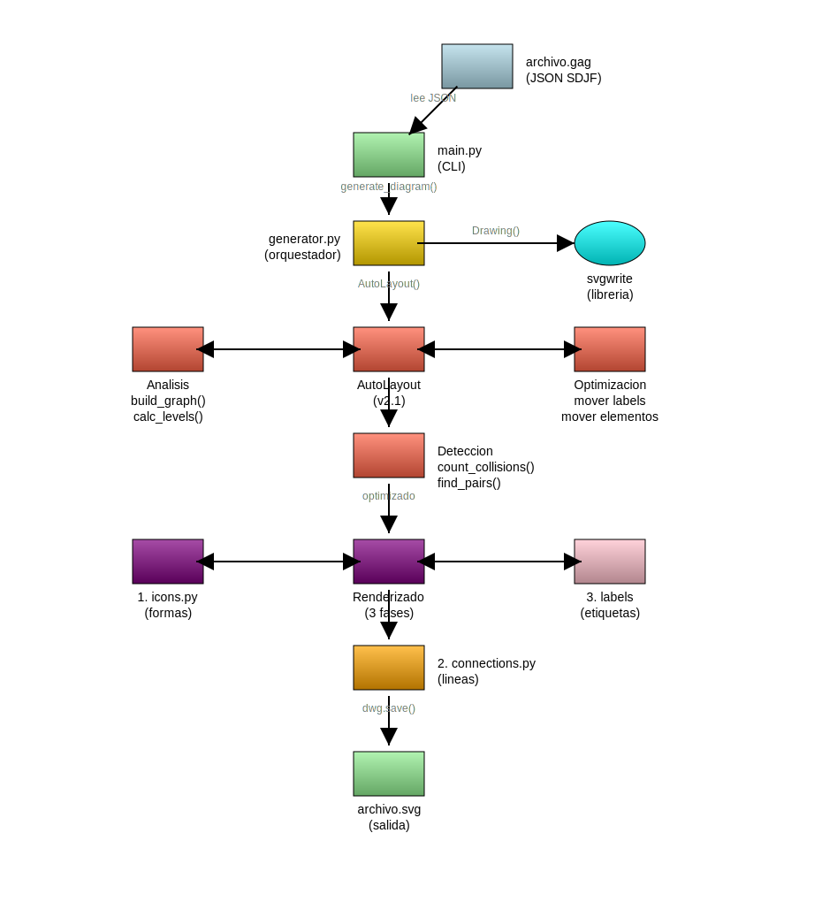

# Evolución de AutoLayout

Este documento rastrea la evolución del sistema AutoLayout de GAG, usando el diagrama de arquitectura (`05-arquitectura-gag.gag`) como benchmark.

---

## v1.0 - Sin AutoLayout

**Estado:** Las etiquetas se posicionaban siempre en `bottom` por defecto.

**Problemas:**
- Colisiones frecuentes entre etiquetas y otros elementos
- El usuario debía especificar `label_position` manualmente

---

## v1.4 - Detección de Colisiones Básica

**Características:**
- Detección de colisiones etiqueta vs ícono
- Detección de colisiones etiqueta vs línea de conexión
- Prueba posiciones en orden: `bottom` → `right` → `top` → `left`

**Limitaciones:**
- Solo mueve etiquetas, no elementos
- No considera la estructura del grafo

---

## v2.0 - Análisis de Grafo y Prioridades

**Fecha:** 2025-01-06

**Características nuevas:**
- Análisis de estructura del grafo (niveles, grupos, conexiones)
- Sistema de prioridades (high/normal/low) basado en número de conexiones
- Estrategia de optimización en 3 fases:
  1. Reubicar etiquetas
  2. Desplazar niveles completos
  3. Expandir canvas como último recurso

**Benchmark - Diagrama de Arquitectura:**


```
[WARN] AutoLayout v2.0: 2 colisiones no resueltas (inicial: 2)
     - 6 niveles, 1 grupo(s)
     - Prioridades: 0 high, 12 normal, 2 low
     - Canvas expandido a 1200x900
```

**Colisiones no resueltas:**
1. Línea diagonal `optimize → phase1` cruza la zona de `phase2`
2. Etiquetas que no encuentran posición libre

**Limitaciones identificadas:**
- No puede mover elementos, solo etiquetas
- No tiene routing inteligente de líneas
- Las líneas diagonales son problemáticas

---

## v2.1 - Movimiento Inteligente de Elementos

**Fecha:** 2025-01-06

**Características nuevas:**
- Identificación de pares en colisión (`_find_collision_pairs()`)
- Cálculo de espacio libre en cada dirección (`_find_free_space()`)
- Selección de elemento a mover por prioridad (`_select_element_to_move()`)
- Movimiento dinámico de elementos (`_calculate_move_direction()`)
- Expansión de canvas según necesidad (`_ensure_canvas_fits()`)

**Benchmark - Diagrama de Arquitectura:**


```
[WARN] AutoLayout v2.1: 1 colisiones no resueltas (inicial: 2)
     - 6 niveles, 1 grupo(s)
     - Prioridades: 0 high, 12 normal, 2 low
     - Canvas expandido a 1200x900
```

**Mejora:** De 2 colisiones (v2.0) a 1 colisión (v2.1)

**Colisión pendiente:**
- Línea diagonal que cruza zona de etiqueta (requiere routing de líneas)

### Rediseño del Diagrama de Arquitectura

**Fecha:** 2026-01-06

El diagrama original tenía problemas de claridad:
- Flechas confusas desde AutoLayout
- No mostraba dónde ocurre el análisis matemático
- Estructura horizontal poco intuitiva

**Nueva estructura vertical:**
```
archivo.gag (input)
    ↓
main.py (CLI)
    ↓
generator.py ──→ svgwrite
    ↓
AutoLayout v2.1 ←→ Analysis / Optimization
    ↓
Detection
    ↓
Renderizado ←→ icons.py / labels
    ↓
connections.py
    ↓
archivo.svg (output)
```



```
[WARN] AutoLayout v2.1: 2 colisiones no resueltas (inicial: 2)
     - 8 niveles, 1 grupo(s)
     - Prioridades: 2 high, 4 normal, 7 low
     - Canvas expandido a 930x1020
```

---

## v2.2 - (Futuro)

**Objetivos:**
- [ ] Routing de conexiones (ortogonal vs diagonal)
- [ ] Waypoints para evitar cruzar elementos
- [ ] Mover grupos de elementos relacionados

---

## Cómo usar este benchmark

Para probar cambios en AutoLayout:

```bash
# Regenerar el diagrama de arquitectura
almagag docs/examples/05-arquitectura-gag.gag
mv 05-arquitectura-gag.svg docs/examples/

# Comparar con versión anterior
# El objetivo es: 0 colisiones sin label_position hardcodeados
```

El diagrama `05-arquitectura-gag.gag` NO tiene `label_position` especificados - AutoLayout debe resolverlo todo automáticamente.
