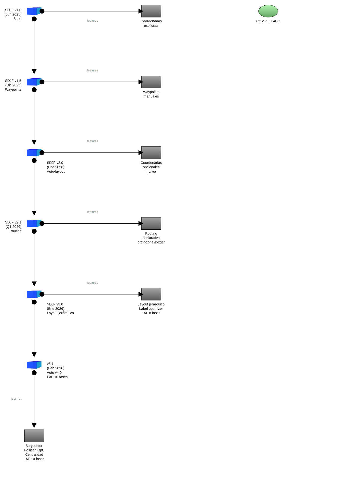
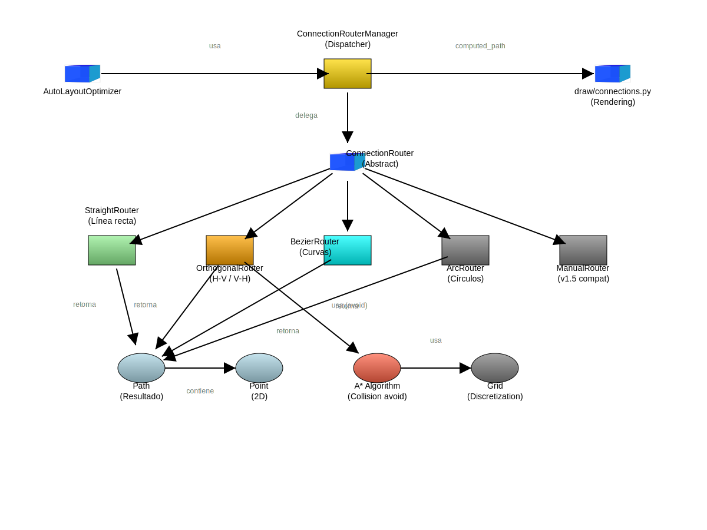

# Índice de Documentación - AlmaGag

**Versión**: v2.1 (código) + SDJF v2.1 (estándar)
**Actualizado**: 2026-01-08

---

## 📚 Documentación Completa

Esta es la guía completa de documentación de AlmaGag, organizada por tipo de documento.

---

## 🚀 Inicio Rápido

**Para usuarios nuevos:**

1. **[README.md](../README.md)** - Visión general y ejemplo mínimo
2. **[Quickstart Guide](guides/QUICKSTART.md)** - Instalación paso a paso
3. **[Galería de Ejemplos](guides/EXAMPLES.md)** - 10 ejemplos visuales

---

## 📖 Especificaciones del Estándar SDJF

**Formato de archivo `.gag` (JSON)**

### Versiones del Estándar

| Documento | Versión | Estado | Descripción |
|-----------|---------|--------|-------------|
| [SDJF v1.0](spec/SDJF_v1.0_SPEC.md) | 1.0 | ✅ Estable | Especificación base (coordenadas requeridas) |
| [SDJF v2.0](spec/SDJF_v2.0_SPEC.md) | 2.0 | ✅ Estable | Auto-layout + sizing proporcional |
| [SDJF v2.0 Features](spec/SDJF_v2.0_FEATURES.md) | 2.0 | ✅ Referencia | Documento original de features v2.0 |
| [SDJF v2.1](spec/SDJF_v2.1_PROPOSAL.md) | 2.1 | ✅ Implementado | Routing declarativo + waypoints automáticos |

### ¿Qué versión debo usar?

- **Empezando**: Lee [v1.0](spec/SDJF_v1.0_SPEC.md) para entender la base
- **Auto-layout**: Lee [v2.0](spec/SDJF_v2.0_SPEC.md) para coordenadas opcionales
- **Routing declarativo**: Lee [v2.1](spec/SDJF_v2.1_PROPOSAL.md) para 5 tipos de líneas

---

## 🎨 Guías de Uso

**Para aprender a usar AlmaGag**

| Documento | Nivel | Descripción |
|-----------|-------|-------------|
| [Quickstart](guides/QUICKSTART.md) | Principiante | Instalación y primer diagrama |
| [Galería de Ejemplos](guides/EXAMPLES.md) | Todos | 10 ejemplos con explicaciones |

### Temas por Feature

- **Íconos y colores** → [Ejemplos 01-04](guides/EXAMPLES.md#01---iconos-registrados)
- **Conexiones y flechas** → [Ejemplo 03](guides/EXAMPLES.md#03---tipos-de-conexiones)
- **Waypoints** → [Ejemplo 06](guides/EXAMPLES.md#06---waypoints-sdjf-v15)
- **Contenedores** → [Ejemplo 07](guides/EXAMPLES.md#07---contenedores-sdjf-v20)
- **Auto-layout** → [Ejemplo 08](guides/EXAMPLES.md#08---auto-layout-completo-sdjf-v20)
- **Sizing proporcional** → [Ejemplo 09](guides/EXAMPLES.md#09---sizing-proporcional-sdjf-v20)
- **Layout híbrido** → [Ejemplo 10](guides/EXAMPLES.md#10---layout-híbrido-sdjf-v20)

---

## 🏗️ Arquitectura del Código

**Para desarrolladores contribuyendo al proyecto**

| Documento | Audiencia | Descripción |
|-----------|-----------|-------------|
| [Architecture](architecture/ARCHITECTURE.md) | Desarrolladores | Diseño modular completo |
| [Evolution](architecture/EVOLUTION.md) | Todos | Historia de versiones |
| [Implementation Strategy](architecture/IMPLEMENTATION_STRATEGY.md) | Implementadores | Guía técnica v2.1 |

### Diagramas de Arquitectura

- **[Arquitectura actual](diagrams/outputs/05-arquitectura-gag.svg)** - Flujo de ejecución v2.1
- **[Historia de arquitecturas](architecture/history/)** - Versiones anteriores

---

## 🗺️ Roadmap y Planificación

**Para entender la dirección del proyecto**

| Documento | Descripción |
|-----------|-------------|
| [ROADMAP.md](ROADMAP.md) | Plan completo de desarrollo |
| [Diagrama de Roadmap](diagrams/svgs/roadmap-versions.svg) | Visualización de versiones |
| [Arquitectura v2.1](diagrams/svgs/routing-architecture.svg) | Diseño del módulo routing |

### Resumen del Roadmap

- **✅ Completado**: v1.0, v1.5, v2.0, v2.1 (código y estándar)
- **🔄 En desarrollo**: v2.2 (collision avoidance)
- **📅 Planificado**: v2.3 (optimizaciones avanzadas), v3.0 (temas)

---

## 📂 Estructura de Documentación

```
docs/
├── INDEX.md                      # Este archivo
├── ROADMAP.md                    # Plan de desarrollo
│
├── spec/                         # Especificaciones SDJF
│   ├── SDJF_v1.0_SPEC.md
│   ├── SDJF_v2.0_SPEC.md
│   ├── SDJF_v2.0_FEATURES.md
│   └── SDJF_v2.1_PROPOSAL.md
│
├── guides/                       # Guías de uso
│   ├── QUICKSTART.md
│   └── EXAMPLES.md
│
├── architecture/                 # Arquitectura del código
│   ├── ARCHITECTURE.md
│   ├── EVOLUTION.md
│   ├── IMPLEMENTATION_STRATEGY.md
│   └── history/                  # Diagramas históricos
│
├── diagrams/                     # Diagramas visuales
│   ├── roadmap-versions.gag
│   ├── roadmap-versions.svg
│   ├── routing-architecture.gag
│   └── routing-architecture.svg
│
└── examples/                     # Archivos .gag y .svg
    ├── 01-iconos-registrados.*
    ├── 02-iconos-no-registrados.*
    ├── 03-conexiones.*
    ├── 04-gradientes-colores.*
    ├── 05-arquitectura-gag.*
    ├── 06-waypoints.*
    ├── 07-containers.*
    ├── 08-auto-layout.*
    ├── 09-proportional-sizing.*
    └── 10-hybrid-layout.*
```

---

## 🎯 Rutas de Aprendizaje

### Ruta 1: Usuario Nuevo

1. [README.md](../README.md) - Visión general
2. [Quickstart](guides/QUICKSTART.md) - Instalación
3. [SDJF v1.0](spec/SDJF_v1.0_SPEC.md) - Formato básico
4. [Galería](guides/EXAMPLES.md) - Ejemplos visuales
5. [SDJF v2.0](spec/SDJF_v2.0_SPEC.md) - Features avanzados

### Ruta 2: Desarrollador Contribuyente

1. [README.md](../README.md) - Contexto
2. [Architecture](architecture/ARCHITECTURE.md) - Diseño del sistema
3. [ROADMAP.md](ROADMAP.md) - Plan de desarrollo
4. [Implementation Strategy](architecture/IMPLEMENTATION_STRATEGY.md) - Guía técnica
5. Código fuente en `AlmaGag/`

### Ruta 3: Implementador v2.1

1. [SDJF v2.1 Proposal](spec/SDJF_v2.1_PROPOSAL.md) - Qué implementar
2. [ROADMAP.md](ROADMAP.md) - Timeline y fases
3. [Implementation Strategy](architecture/IMPLEMENTATION_STRATEGY.md) - Cómo implementar
4. [Architecture](architecture/ARCHITECTURE.md) - Dónde integrar
5. Comenzar con Fase 1

---

## 🔍 Búsqueda Rápida

### Por Concepto

- **Auto-layout**: [v2.0 Spec](spec/SDJF_v2.0_SPEC.md), [Ejemplo 08](guides/EXAMPLES.md#08---auto-layout-completo-sdjf-v20)
- **Sizing (hp/wp)**: [v2.0 Spec](spec/SDJF_v2.0_SPEC.md#proportional-sizing), [Ejemplo 09](guides/EXAMPLES.md#09---sizing-proporcional-sdjf-v20)
- **Waypoints**: [v1.5 Info](spec/SDJF_v1.0_SPEC.md#waypoints), [v2.1 Proposal](spec/SDJF_v2.1_PROPOSAL.md)
- **Routing**: [v2.1 Proposal](spec/SDJF_v2.1_PROPOSAL.md)
- **Contenedores**: [Ejemplo 07](guides/EXAMPLES.md#07---contenedores-sdjf-v20)
- **Prioridades**: [v2.0 Spec](spec/SDJF_v2.0_SPEC.md#auto-layout)

### Por Pregunta

- **¿Cómo instalo?** → [Quickstart](guides/QUICKSTART.md#instalación)
- **¿Cómo hago mi primer diagrama?** → [Quickstart](guides/QUICKSTART.md#primer-diagrama)
- **¿Qué tipos de íconos hay?** → [SDJF v1.0](spec/SDJF_v1.0_SPEC.md#tipos-de-íconos-disponibles)
- **¿Cómo funciona auto-layout?** → [SDJF v2.0](spec/SDJF_v2.0_SPEC.md#auto-layout)
- **¿Cómo contribuyo?** → [ROADMAP](ROADMAP.md#contribuciones)
- **¿Cuál es el roadmap?** → [ROADMAP.md](ROADMAP.md)
- **¿Cómo funciona el código?** → [Architecture](architecture/ARCHITECTURE.md)

---

## 📊 Diagrams

### Roadmap



Muestra la evolución de SDJF desde v1.0 hasta v3.0 planificado.

### Arquitectura v2.1



Muestra el diseño propuesto del módulo `routing/` para v2.1.

### Arquitectura v2.1 (Código Actual)


Diagrama auto-documentado del flujo de ejecución actual.

---

## 🤝 Contribuir

¿Quieres contribuir? Lee:

1. [ROADMAP.md](ROADMAP.md) - Qué necesita el proyecto
2. [Architecture](architecture/ARCHITECTURE.md) - Cómo está estructurado
3. [Implementation Strategy](architecture/IMPLEMENTATION_STRATEGY.md) - Guía técnica

**Áreas prioritarias:**
- [ ] Implementación v2.2 (collision avoidance con A*)
- [ ] Tests visuales automáticos
- [ ] Nuevos tipos de íconos
- [ ] Documentación de ejemplos
- [ ] Optimizaciones de performance

---

## 📄 Licencia

[Especificar licencia aquí]

---

## 📞 Contacto

Este proyecto es parte de ALMA. Para reportar bugs o sugerir mejoras, abre un issue en el repositorio.

---

**AlmaGag** - Generación automática de diagramas con auto-layout inteligente y routing declarativo
**Versión**: v2.1 + SDJF v2.1 | **Actualizado**: 2026-01-08
