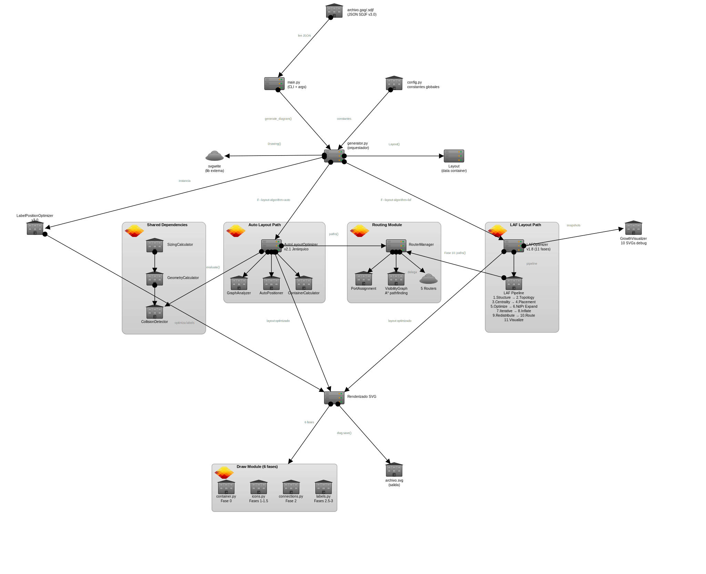

# Arquitectura de AlmaGag

**Versión del Código**: v3.2.0 + SDJF v2.0
**Fecha**: 2026-02-19

## Visión General

AlmaGag es un generador de diagramas SVG que transforma archivos JSON (formato SDJF) en gráficos vectoriales mediante un pipeline de procesamiento modular. Soporta dos algoritmos de layout: **AUTO** (legacy, basado en colisiones) y **LAF** (recomendado, Layout Abstracto Primero con 9 fases).

## Diagrama de Arquitectura



## Flujo de Ejecución

```
┌─────────────┐
│  archivo.gag│
│   (SDJF)    │
└──────┬──────┘
       │
       v
┌─────────────┐
│  main.py    │  CLI entry point
└──────┬──────┘
       │
       v
┌─────────────────────────────────────────────────────┐
│  generator.py  (Orquestador)                         │
│  ┌───────────────────────────────────────────────┐  │
│  │  1. Parse JSON → Layout (inmutable)           │  │
│  │  2. Selección de algoritmo:                   │  │
│  │     ├─ LAF: LAFOptimizer (9 fases)            │  │
│  │     └─ AUTO: AutoLayoutOptimizer (legacy)     │  │
│  │  3. Create SVG canvas + filters (blur glow)   │  │
│  │  4. NdFn metadata wrapping (DrawingGroupProxy)│  │
│  │  5. Render: containers → icons → connections  │  │
│  │  6. Labels con filter="url(#text-glow)"       │  │
│  │  7. Label optimization (excluir contenidos)   │  │
│  └───────────────────────────────────────────────┘  │
└──────┬──────────────────────────────────────────────┘
       │
       v
┌─────────────┐
│ archivo.svg │  (con <desc> NdFn metadata)
└─────────────┘
```

### Pipeline LAF (9 Fases)

```
Fase 1: Structure Analysis    → structure_analyzer.py
Fase 2: Topology Analysis     → laf_optimizer.py (viz)
Fase 3: Centrality Ordering   → laf_optimizer.py
Fase 4: Abstract Placement    → abstract_placer.py
Fase 5: Position Optimization → position_optimizer.py
Fase 6: Inflation + Growth    → inflator.py + container_grower.py
Fase 7: Redistribution        → laf_optimizer.py
Fase 8: Routing               → router_manager.py
Fase 9: SVG Generation        → generator.py
```

## Módulos Principales

### 1. `main.py`

**Responsabilidad:** Punto de entrada CLI

**Argumentos principales:**
- `archivo.gag` - Archivo de entrada (SDJF JSON)
- `--layout-algorithm={auto|laf}` - Selección de algoritmo (default: auto)
- `-o output.svg` - Archivo de salida
- `--debug` - Logs detallados
- `--visualdebug` - Elementos visuales de debug (grilla, niveles, NdFn labels)
- `--visualize-growth` - Genera 9 SVGs de cada fase LAF
- `--color-connections` - Conexiones con colores únicos
- `--exportpng` - Exporta también a PNG

---

### 2. `generator.py`

**Responsabilidad:** Orquestador del proceso completo

```python
def generate_diagram(input_file):
    # 1. Leer y parsear JSON
    with open(input_file, 'r', encoding='utf-8') as f:
        data = json.load(f)

    # 2. Crear Layout inmutable
    initial_layout = Layout(
        elements=data['elements'],
        connections=data['connections'],
        canvas=data.get('canvas', {'width': 1400, 'height': 900})
    )

    # 3. Optimizar (auto-layout + collision resolution)
    optimizer = AutoLayoutOptimizer()
    optimized_layout = optimizer.optimize(initial_layout, max_iterations=10)

    # 4. Crear canvas SVG
    dwg = svgwrite.Drawing(output_file, size=(width, height))

    # 5. Definir markers (flechas)
    define_arrow_markers(dwg)

    # 6. Renderizar en orden
    #    a. Contenedores (fondo)
    for container in containers:
        draw_container(dwg, container, elements_by_id)

    #    b. Íconos (sin labels)
    for element in normal_elements:
        draw_icon_shape(dwg, element)

    #    c. Conexiones (sin labels)
    for connection in connections:
        draw_connection_line(dwg, elements_by_id, connection, markers)

    #    d. Todas las labels (íconos + conexiones)
    for element in normal_elements:
        draw_icon_label(dwg, element, label_positions[element['id']])
    for connection in connections:
        draw_connection_label(dwg, elements_by_id, connection)

    # 7. Guardar archivo
    dwg.save()
```

**Orden de renderizado (crítico para z-index visual):**
1. **Contenedores** → Fondo transparente
2. **Íconos** (shapes) → Encima de contenedores
3. **Conexiones** (líneas) → Encima de íconos
4. **Labels** → Encima de todo (legibilidad)

---

### 3. `config.py`

**Responsabilidad:** Constantes globales

```python
# Dimensiones base de íconos (usadas por hp/wp en SDJF v2.0)
ICON_WIDTH = 80
ICON_HEIGHT = 50

# Tamaño de canvas por defecto
DEFAULT_CANVAS_WIDTH = 1400
DEFAULT_CANVAS_HEIGHT = 900
```

---

### 4. Módulo `layout/` (Refactorización v2.1)

**Responsabilidad:** Almacenamiento de datos y optimización

#### `layout/layout.py`

**Clase `Layout`** - Contenedor inmutable del estado

```python
@dataclass
class Layout:
    elements: List[dict]
    connections: List[dict]
    canvas: dict
    elements_by_id: dict = field(init=False)

    # Atributos de análisis (escritos por optimizador)
    levels: dict = field(default_factory=dict)
    groups: List[Set[str]] = field(default_factory=list)
    priorities: dict = field(default_factory=dict)

    def copy(self) -> 'Layout':
        """Crea deep copy independiente para optimización."""
        return Layout(
            elements=deepcopy(self.elements),
            connections=deepcopy(self.connections),
            canvas=self.canvas.copy()
        )
```

**Patrón de diseño:** Inmutabilidad
- `optimize()` NO modifica el layout original
- Retorna nuevo layout optimizado
- Permite comparar candidatos durante iteraciones

#### `layout/optimizer_base.py`

**Clase abstracta `LayoutOptimizer`**

```python
class LayoutOptimizer(ABC):
    @abstractmethod
    def optimize(self, layout: Layout, max_iterations: int) -> Layout:
        """Optimiza layout, retorna nuevo layout."""
        pass
```

**Propósito:** Interfaz para futuros algoritmos (force-directed, genetic, etc.)

#### `layout/auto_optimizer.py`

**Clase `AutoLayoutOptimizer`** - Implementación v2.1

```python
class AutoLayoutOptimizer(LayoutOptimizer):
    def __init__(self, verbose=False):
        self.sizing = SizingCalculator()  # SDJF v2.0
        self.geometry = GeometryCalculator(self.sizing)
        self.collision_detector = CollisionDetector(self.geometry)
        self.graph_analyzer = GraphAnalyzer()
        self.positioner = AutoLayoutPositioner(self.sizing, self.graph_analyzer)  # v2.0
        self.verbose = verbose

    def optimize(self, layout, max_iterations=10) -> Layout:
        current = layout.copy()

        # FASE 0: Auto-layout para coordenadas faltantes (SDJF v2.0)
        self.analyze(current)  # Análisis preliminar para prioridades
        self.positioner.calculate_missing_positions(current)

        # FASE 1: Análisis completo
        self.analyze(current)
        self._calculate_initial_positions(current)  # Posiciones de labels
        initial_collisions = self.evaluate(current)

        # FASE 2: Optimización iterativa
        best_layout = current
        min_collisions = initial_collisions

        for iteration in range(max_iterations):
            if min_collisions == 0:
                break

            candidate = best_layout.copy()

            # Estrategia A: Reubicar labels
            if not self._try_relocate_labels(candidate):
                # Estrategia B: Mover elementos (weighted, v2.0)
                victim_id = self._select_element_to_move_weighted(candidate)
                if victim_id:
                    dx, dy = self._calculate_move_direction(candidate, victim_id)

                    # Escalar movimiento por peso inverso (SDJF v2.0)
                    elem = candidate.elements_by_id[victim_id]
                    weight = self.sizing.get_element_weight(elem)
                    dx = int(dx / weight)
                    dy = int(dy / weight)

                    self._shift_element(candidate, victim_id, dx, dy)
                    self._recalculate_structures(candidate)

            collisions = self.evaluate(candidate)
            if collisions < min_collisions:
                best_layout = candidate
                min_collisions = collisions

        return best_layout
```

**Algoritmo:**
1. **Auto-positioning** (v2.0) - Calcula x, y faltantes
2. **Análisis** - Niveles, grupos, prioridades
3. **Optimización iterativa**:
   - Estrategia A: Reposicionar labels (bottom → right → top → left)
   - Estrategia B: Mover elementos completos (weighted por hp/wp)
4. **Evaluación** - Cuenta colisiones totales
5. **Hill climbing** - Acepta solo mejoras

#### `layout/sizing.py` (NUEVO en v2.0)

**Clase `SizingCalculator`** - Soporte para hp/wp

```python
class SizingCalculator:
    def get_element_size(self, element) -> Tuple[float, float]:
        """Calcula (width, height) final considerando hp/wp."""
        if 'width' in element and 'height' in element:
            return (element['width'], element['height'])

        hp = element.get('hp', 1.0)
        wp = element.get('wp', 1.0)

        width = element.get('width', ICON_WIDTH * wp)
        height = element.get('height', ICON_HEIGHT * hp)

        return (width, height)

    def get_element_weight(self, element) -> float:
        """Peso = hp × wp (para optimización)."""
        hp = element.get('hp', 1.0)
        wp = element.get('wp', 1.0)
        return hp * wp

    def get_centrality_score(self, element, priority: int) -> float:
        """Score = (3 - priority) × hp × wp."""
        hp = element.get('hp', 1.0)
        wp = element.get('wp', 1.0)
        priority_weight = 3 - priority
        return priority_weight * hp * wp
```

#### `layout/auto_positioner.py` (NUEVO en v2.0)

**Clase `AutoLayoutPositioner`** - Auto-layout para SDJF v2.0

```python
class AutoLayoutPositioner:
    def calculate_missing_positions(self, layout):
        """Calcula x, y para elementos sin coordenadas."""
        missing_both = [e for e in layout.elements if 'x' not in e and 'y' not in e]
        missing_x = [e for e in layout.elements if 'x' not in e and 'y' in e]
        missing_y = [e for e in layout.elements if 'x' in e and 'y' not in e]

        if missing_x:
            self._calculate_x_only(layout, missing_x)
        if missing_y:
            self._calculate_y_only(layout, missing_y)
        if missing_both:
            self._calculate_hybrid_layout(layout, missing_both)

    def _calculate_hybrid_layout(self, layout, elements):
        """Algoritmo híbrido: prioridad + grid + centralidad."""
        # Agrupar por prioridad
        by_priority = {0: [], 1: [], 2: []}  # HIGH, NORMAL, LOW
        for elem in elements:
            priority = layout.priorities.get(elem['id'], 1)
            by_priority[priority].append(elem)

        center_x = layout.canvas['width'] / 2
        center_y = layout.canvas['height'] / 2

        # Ordenar por centrality_score
        high_elements = sorted(
            by_priority[0],
            key=lambda e: self.sizing.get_centrality_score(e, 0),
            reverse=True
        )

        # Posicionar
        self._position_grid_center(high_elements, center_x, center_y, spacing=120)
        self._position_ring(by_priority[1], center_x, center_y, radius=300)
        self._position_ring(by_priority[2], center_x, center_y, radius=450)
```

**Estrategia de posicionamiento:**
- **HIGH priority** → Grid compacto en centro
- **NORMAL priority** → Anillo (radius 300px)
- **LOW priority** → Anillo externo (radius 450px)
- **Centralidad** → Elementos grandes más cerca del centro

#### `layout/geometry.py`

**Clase `GeometryCalculator`** - Cálculos geométricos

```python
class GeometryCalculator:
    def __init__(self, sizing=None):
        self.sizing = sizing

    def get_icon_bbox(self, element) -> Optional[Tuple]:
        """Retorna (x1, y1, x2, y2) o None si falta coord."""
        x = element.get('x')
        y = element.get('y')
        if x is None or y is None:
            return None

        # Usar sizing para hp/wp (v2.0)
        if self.sizing:
            width, height = self.sizing.get_element_size(element)
        else:
            width, height = ICON_WIDTH, ICON_HEIGHT

        return (x, y, x + width, y + height)

    def rectangles_intersect(self, bbox1, bbox2) -> bool:
        """Detecta overlap entre dos rectángulos."""
        x1_min, y1_min, x1_max, y1_max = bbox1
        x2_min, y2_min, x2_max, y2_max = bbox2

        return not (x1_max <= x2_min or x2_max <= x1_min or
                    y1_max <= y2_min or y2_max <= y1_min)

    def line_intersects_rect(self, line_start, line_end, bbox) -> bool:
        """Detecta si línea cruza rectángulo."""
        # Implementación usando algoritmo de Cohen-Sutherland
        # ...
```

#### `layout/collision.py`

**Clase `CollisionDetector`** - Detección de colisiones

```python
class CollisionDetector:
    def __init__(self, geometry):
        self.geometry = geometry

    def detect_all_collisions(self, layout) -> List[Tuple]:
        """Retorna lista de colisiones (id1, id2, tipo)."""
        collisions = []
        all_bboxes = self._collect_all_bboxes(layout)

        for i, (bbox1, type1, id1) in enumerate(all_bboxes):
            for bbox2, type2, id2 in all_bboxes[i+1:]:
                if self.geometry.rectangles_intersect(bbox1, bbox2):
                    collisions.append((id1, id2, f"{type1}-{type2}"))

        return collisions

    def _collect_all_bboxes(self, layout):
        """Recolecta bboxes de íconos, labels y conexiones."""
        bboxes = []

        # Filtrar elementos sin coordenadas (v2.0)
        positioned = [e for e in layout.elements if 'x' in e and 'y' in e]

        # Bboxes de íconos
        for elem in positioned:
            bbox = self.geometry.get_icon_bbox(elem)
            if bbox:
                bboxes.append((bbox, 'icon', elem['id']))

        # Bboxes de labels
        for elem in positioned:
            label_pos = layout.label_positions.get(elem['id'])
            if label_pos:
                bbox = self.geometry.get_label_bbox(elem, label_pos)
                if bbox:
                    bboxes.append((bbox, 'label', elem['id']))

        # Bboxes de conexiones
        # ...

        return bboxes
```

#### `layout/graph_analysis.py`

**Clase `GraphAnalyzer`** - Análisis de estructura

```python
class GraphAnalyzer:
    def calculate_priorities(self, layout):
        """Calcula prioridades basadas en conexiones."""
        connection_count = {}

        for conn in layout.connections:
            for node_id in [conn['from'], conn['to']]:
                connection_count[node_id] = connection_count.get(node_id, 0) + 1

        priorities = {}
        for elem in layout.elements:
            elem_id = elem['id']

            # Manual override
            if 'label_priority' in elem:
                priority_map = {'high': 0, 'normal': 1, 'low': 2}
                priorities[elem_id] = priority_map.get(elem['label_priority'], 1)
            else:
                # Automático
                count = connection_count.get(elem_id, 0)
                if count >= 4:
                    priorities[elem_id] = 0  # HIGH
                elif count >= 2:
                    priorities[elem_id] = 1  # NORMAL
                else:
                    priorities[elem_id] = 2  # LOW

        layout.priorities = priorities

    def identify_groups(self, layout):
        """Identifica componentes conectados (DFS)."""
        # Implementación estándar de DFS
        # ...
```

---

### 5. Módulo `layout/laf/` (LAF Pipeline v2.0)

**Responsabilidad:** Layout jerárquico de 9 fases minimizando cruces

**Módulos:**
- `structure_analyzer.py` - Fase 1: Árbol, grafo, niveles, scores
- `abstract_placer.py` - Fase 4: Sugiyama-style placement
- `position_optimizer.py` - Fase 5: Layer-offset bisection
- `inflator.py` - Fase 6: Abstract → real coordinates
- `container_grower.py` - Fase 6: Bottom-up expansion, label-aware
- `visualizer.py` - 9 SVGs de debug del proceso

**Coordinador:** `layout/laf_optimizer.py:LAFOptimizer`

```python
class LAFOptimizer:
    def optimize(self, layout):
        # Fase 1: Structure Analysis
        structure_info = self.analyzer.analyze(layout)
        # Fase 2: Topology Analysis (visualización)
        # Fase 3: Centrality Ordering
        # Fase 4: Abstract Placement (Sugiyama)
        abstract_positions = self.placer.place_elements(structure_info)
        # Fase 5: Position Optimization (bisection)
        optimized = self.position_optimizer.optimize(abstract_positions)
        # Fase 6: Inflation + Container Growth
        self.inflator.inflate(optimized, structure_info, layout)
        self.grower.grow_containers(structure_info, layout)
        # Fase 7: Vertical Redistribution
        self._redistribute_vertical_after_growth(structure_info, layout)
        # Fase 8: Routing
        # Fase 9: SVG Generation (en generator.py)
        return layout
```

**Resultado:** -87% cruces, -24% colisiones vs sistema AUTO

---

### 6. Módulo `draw/`

**Responsabilidad:** Renderizado SVG

#### `draw/icons.py`

**Dispatcher de íconos + sistema de gradientes + blur glow**

```python
def create_gradient(dwg, element_id, base_color):
    """Crea gradiente lineal (claro → oscuro)."""
    gradient_id = f'gradient-{element_id}'
    light_color = adjust_lightness(base_color, 1.3)
    dark_color = adjust_lightness(base_color, 0.7)

    gradient = dwg.linearGradient(id=gradient_id, x1="0%", y1="0%", x2="0%", y2="100%")
    gradient.add_stop_color(offset="0%", color=light_color)
    gradient.add_stop_color(offset="100%", color=dark_color)
    dwg.defs.add(gradient)

    return f'url(#{gradient_id})'

def draw_icon_shape(dwg, element):
    """Dispatcher dinámico de íconos."""
    x, y = element.get('x'), element.get('y')
    if x is None or y is None:
        return  # Sin coords, skip (v2.0)

    elem_type = element.get('type', 'unknown')
    color = element.get('color', 'gray')
    element_id = element.get('id', f'{elem_type}_{x}_{y}')

    try:
        module = importlib.import_module(f'AlmaGag.draw.{elem_type}')
        draw_func = getattr(module, f'draw_{elem_type}')
        draw_func(dwg, x, y, color, element_id)
    except Exception as e:
        # Fallback: Banana With Tape
        from AlmaGag.draw.bwt import draw_bwt
        draw_bwt(dwg, x, y)

def draw_icon_label(dwg, element, label_pos):
    """Dibuja label del ícono (separado de shape)."""
    # ...
```

**Módulos de íconos específicos:**
- `server.py` - Rectángulo con gradiente
- `building.py` - Rectángulo con gradiente
- `cloud.py` - Elipse con gradiente
- `firewall.py` - Rectángulo con gradiente
- `bwt.py` - Plátano con cinta (fallback)

#### `draw/connections.py`

**Renderizado de conexiones**

```python
def draw_connection_line(dwg, elements_by_id, connection, markers):
    """Dibuja línea de conexión (recta o con waypoints)."""
    from_elem = elements_by_id.get(connection['from'])
    to_elem = elements_by_id.get(connection['to'])

    # Validar coordenadas (v2.0)
    if not from_elem or not to_elem:
        return None
    if from_elem.get('x') is None or to_elem.get('x') is None:
        return None

    # Waypoints (v1.5)
    waypoints = connection.get('waypoints', [])

    if waypoints:
        # Polyline con puntos intermedios
        points = []
        # ... calcular offsets ...
        polyline = dwg.polyline(points, stroke='black', fill='none')
        dwg.add(polyline)
    else:
        # Línea recta
        line = dwg.line(start=(from_x, from_y), end=(to_x, to_y),
                        stroke='black', fill='none')
        dwg.add(line)

    # Aplicar markers (flechas)
    direction = connection.get('direction', 'none')
    if direction == 'forward':
        line['marker-end'] = markers['arrow-end']
    elif direction == 'backward':
        line['marker-start'] = markers['arrow-start']
    elif direction == 'bidirectional':
        line['marker-start'] = markers['arrow-start']
        line['marker-end'] = markers['arrow-end']

    return line

def draw_connection_label(dwg, elements_by_id, connection):
    """Dibuja label en el centro de la conexión."""
    # ...
```

#### `draw/container.py` (NUEVO en v2.0)

**Renderizado de contenedores**

```python
def draw_container(dwg, container, elements_by_id):
    """Dibuja rectángulo redondeado alrededor de elementos."""
    # Calcular bounds dinámicamente
    bounds = calculate_container_bounds(container, elements_by_id)

    # Dibujar rectángulo con gradiente
    gradient_id = create_gradient(dwg, container['id'], container.get('color', 'lightgray'))
    rect = dwg.rect(
        insert=(bounds['x'], bounds['y']),
        size=(bounds['width'], bounds['height']),
        rx=radius, ry=radius,
        fill=gradient_id,
        opacity=0.3
    )
    dwg.add(rect)

    # Dibujar ícono en esquina
    # ...

    # Dibujar label
    # ...

def calculate_container_bounds(container, elements_by_id):
    """Calcula bounding box de elementos contenidos."""
    contained_ids = container['contains']
    contained = [elements_by_id[id] for id in contained_ids if id in elements_by_id]

    # Calcular min/max de x, y
    # ...

    # Aplicar padding y aspect_ratio
    # ...
```

---

## Patrones de Diseño Utilizados

### 1. Inmutabilidad (Layout)

```python
# NO modifica el layout original
optimized = optimizer.optimize(initial_layout)

# Layout.copy() crea deep copies independientes
candidate = best_layout.copy()
```

**Beneficios:**
- Facilita debugging (comparar estados)
- Thread-safe (futuro)
- Optimización transparente

### 2. Strategy Pattern (LayoutOptimizer)

```python
class LayoutOptimizer(ABC):
    @abstractmethod
    def optimize(self, layout, max_iterations):
        pass

class AutoLayoutOptimizer(LayoutOptimizer):
    # Implementación específica
```

**Beneficios:**
- Fácil agregar nuevos algoritmos
- Intercambiable en runtime
- Testeable independientemente

### 3. Dependency Injection

```python
class AutoLayoutOptimizer:
    def __init__(self):
        self.sizing = SizingCalculator()
        self.geometry = GeometryCalculator(self.sizing)  # DI
        self.collision_detector = CollisionDetector(self.geometry)  # DI
```

**Beneficios:**
- Componentes desacoplados
- Fácil de testear con mocks
- Flexible para modificaciones

### 4. Dynamic Import (Íconos)

```python
module = importlib.import_module(f'AlmaGag.draw.{elem_type}')
draw_func = getattr(module, f'draw_{elem_type}')
```

**Beneficios:**
- Fácil agregar nuevos tipos
- No requiere registry centralizado
- Fallback transparente

### 5. Pipeline (Generator)

```
Parse → Layout → Optimize → Create Canvas → Render → Save
```

**Beneficios:**
- Flujo claro y linear
- Fácil insertar pasos intermedios
- Cada paso tiene responsabilidad única

---

## Estructura de Directorios

```
AlmaGag/
├── main.py                 # CLI entry point
├── generator.py            # Orquestador + NdFn metadata + blur filter
├── config.py               # Constantes globales
│
├── layout/                 # Módulo de Layout y Optimización
│   ├── __init__.py
│   ├── layout.py           # Clase Layout (inmutable)
│   ├── optimizer_base.py   # Interfaz LayoutOptimizer
│   ├── auto_optimizer.py   # AutoLayoutOptimizer v4.0 (legacy)
│   ├── auto_positioner.py  # AutoLayoutPositioner v4.0
│   ├── laf_optimizer.py    # LAFOptimizer v2.0 (9 fases, recomendado)
│   ├── sizing.py           # SizingCalculator (SDJF v2.0)
│   ├── geometry.py         # GeometryCalculator
│   ├── collision.py        # CollisionDetector (skip parent-child)
│   ├── graph_analysis.py   # GraphAnalyzer + topología + centralidad
│   └── laf/                # Módulos del pipeline LAF
│       ├── __init__.py
│       ├── README.md             # Documentación técnica LAF
│       ├── structure_analyzer.py # Fase 1: Estructura + niveles + scores
│       ├── abstract_placer.py    # Fase 4: Sugiyama-style placement
│       ├── position_optimizer.py # Fase 5: Layer-offset bisection
│       ├── inflator.py           # Fase 6: Inflación
│       ├── container_grower.py   # Fase 6: Crecimiento + label-aware
│       └── visualizer.py         # 9 SVGs de visualización
│
├── routing/                # Módulo de routing de conexiones
│   └── router_manager.py   # Self-loops, container borders, arc/ortho/direct
│
├── draw/                   # Módulo de renderizado SVG
│   ├── __init__.py
│   ├── icons.py            # Dispatcher + gradientes + blur glow
│   ├── connections.py      # Líneas + self-loops + colored connections
│   ├── container.py        # Contenedores + label-aware bounds
│   ├── bwt.py              # Banana With Tape (fallback)
│   ├── server.py, cloud.py, building.py, firewall.py, ...
│   └── (nuevos tipos via dynamic import)
│
└── docs/                   # Documentación
    ├── spec/               # Especificaciones SDJF
    ├── architecture/       # Arquitectura del código
    ├── guides/             # Guías de uso + CLI reference
    └── diagrams/           # .gag fuentes + .svg generados
```

---

## Extensibilidad

### Agregar Nuevo Tipo de Ícono

1. Crear `draw/mi_icono.py`:
```python
from AlmaGag.config import ICON_WIDTH, ICON_HEIGHT
from AlmaGag.draw.icons import create_gradient

def draw_mi_icono(dwg, x, y, color, element_id):
    fill = create_gradient(dwg, element_id, color)
    # Dibujar usando SVG primitives
    dwg.add(dwg.circle(center=(x + ICON_WIDTH/2, y + ICON_HEIGHT/2),
                       r=25, fill=fill, stroke='black'))
```

2. Usar en SDJF:
```json
{
  "id": "elem1",
  "type": "mi_icono",
  "x": 100,
  "y": 200
}
```

**No requiere modificar código existente** (dynamic import).

### Agregar Nuevo Optimizador

1. Crear `layout/mi_optimizer.py`:
```python
from AlmaGag.layout.optimizer_base import LayoutOptimizer

class MiOptimizer(LayoutOptimizer):
    def optimize(self, layout, max_iterations):
        # Implementación personalizada
        optimized_layout = layout.copy()
        # ... algoritmo ...
        return optimized_layout
```

2. Usar en `generator.py`:
```python
from AlmaGag.layout.mi_optimizer import MiOptimizer

optimizer = MiOptimizer()
optimized_layout = optimizer.optimize(initial_layout)
```

---

## Performance

### Complejidad Temporal

| Operación | Complejidad | Notas |
|-----------|-------------|-------|
| Parse JSON | O(n) | n = elementos + conexiones |
| Auto-positioning | O(n log n) | Sorting por centrality |
| Collision detection | O(n²) | All-pairs comparison |
| Optimization (1 iter) | O(n²) | Colisiones + movimiento |
| SVG rendering | O(n) | Linear por cada elemento |

**Total:** O(k × n²) donde k = max_iterations

### Optimizaciones Implementadas

1. **Early exit**: Si 0 colisiones, termina iteraciones
2. **Bbox caching**: Bboxes calculados una vez por iteración
3. **Priority queues**: Elementos ordenados por score
4. **Lazy evaluation**: Solo calcula lo necesario

### Escalabilidad

- **Pequeño** (<20 elementos): Instantáneo (<0.1s)
- **Mediano** (20-100 elementos): Rápido (<1s)
- **Grande** (100-500 elementos): Aceptable (1-5s)
- **Muy grande** (>500 elementos): Puede requerir optimización

**Recomendación:** Para diagramas >500 elementos, considerar spatial hashing o quadtrees.

---

## Testing

### Estrategia de Testing

1. **Unit tests**: Cada componente independiente
   - `GeometryCalculator.rectangles_intersect()`
   - `SizingCalculator.get_element_weight()`
   - `GraphAnalyzer.calculate_priorities()`

2. **Integration tests**: Flujo completo
   - Parse SDJF → Optimize → Render
   - Verificar SVG generado válido

3. **Visual regression tests**: Comparar SVGs
   - Regenerar ejemplos después de cambios
   - Diff visual con herramientas como Playwright

### Archivos de Test Actuales

```
docs/examples/
├── 01-iconos-registrados.gag       # Tipos de íconos
├── 02-iconos-no-registrados.gag    # Fallback BWT
├── 03-conexiones.gag                # Direcciones de flechas
├── 04-gradientes-colores.gag        # Sistema de colores
├── 05-arquitectura-gag.gag          # Diagrama complejo
├── 06-waypoints.gag                 # Waypoints v1.5
├── 07-containers.gag                # Contenedores v2.0
├── 08-auto-layout.gag               # Auto-layout v2.0
├── 09-proportional-sizing.gag       # hp/wp v2.0
└── 10-hybrid-layout.gag             # Híbrido v2.0
```

**Validación:** Regenerar todos los .svg y verificar visualmente

---

## Dependencias

```
svgwrite>=1.4.3     # Generación de SVG
```

**Filosofía:** Dependencias mínimas, código autónomo.

---

**Última actualización**: 2026-02-19
**Versión documentada**: AlmaGag v3.2.0 + SDJF v2.0 | LAF Pipeline 9 fases
