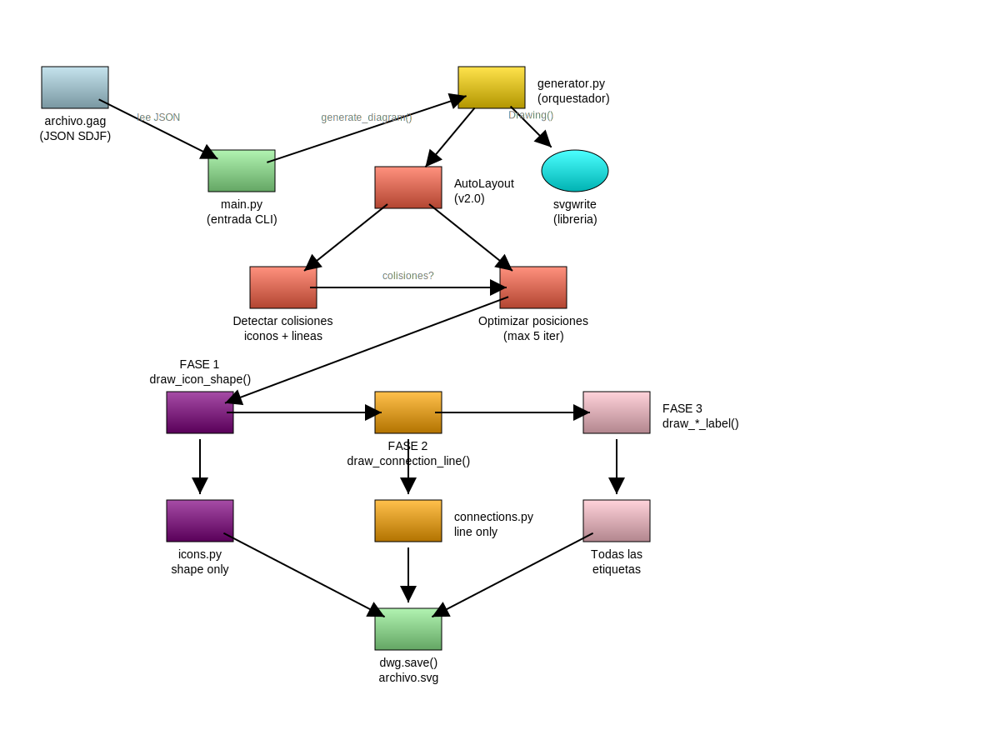

# Evolución de AutoLayout

Este documento rastrea la evolución del sistema AutoLayout de GAG, usando el diagrama de arquitectura (`05-arquitectura-gag.gag`) como benchmark.

---

## v1.0 - Sin AutoLayout

**Estado:** Las etiquetas se posicionaban siempre en `bottom` por defecto.

**Problemas:**
- Colisiones frecuentes entre etiquetas y otros elementos
- El usuario debía especificar `label_position` manualmente

---

## v1.4 - Detección de Colisiones Básica

**Características:**
- Detección de colisiones etiqueta vs ícono
- Detección de colisiones etiqueta vs línea de conexión
- Prueba posiciones en orden: `bottom` → `right` → `top` → `left`

**Limitaciones:**
- Solo mueve etiquetas, no elementos
- No considera la estructura del grafo

---

## v2.0 - Análisis de Grafo y Prioridades

**Fecha:** 2025-01-06

**Características nuevas:**
- Análisis de estructura del grafo (niveles, grupos, conexiones)
- Sistema de prioridades (high/normal/low) basado en número de conexiones
- Estrategia de optimización en 3 fases:
  1. Reubicar etiquetas
  2. Desplazar niveles completos
  3. Expandir canvas como último recurso

**Benchmark - Diagrama de Arquitectura:**


```
[WARN] AutoLayout v2.0: 2 colisiones no resueltas (inicial: 2)
     - 6 niveles, 1 grupo(s)
     - Prioridades: 0 high, 12 normal, 2 low
     - Canvas expandido a 1200x900
```

**Colisiones no resueltas:**
1. Línea diagonal `optimize → phase1` cruza la zona de `phase2`
2. Etiquetas que no encuentran posición libre

**Limitaciones identificadas:**
- No puede mover elementos, solo etiquetas
- No tiene routing inteligente de líneas
- Las líneas diagonales son problemáticas

---

## v2.1 - Movimiento Inteligente de Elementos

**Fecha:** 2025-01-06

**Características nuevas:**
- Identificación de pares en colisión (`_find_collision_pairs()`)
- Cálculo de espacio libre en cada dirección (`_find_free_space()`)
- Selección de elemento a mover por prioridad (`_select_element_to_move()`)
- Movimiento dinámico de elementos (`_calculate_move_direction()`)
- Expansión de canvas según necesidad (`_ensure_canvas_fits()`)

**Benchmark - Diagrama de Arquitectura:**



```
[WARN] AutoLayout v2.1: 1 colisiones no resueltas (inicial: 2)
     - 6 niveles, 1 grupo(s)
     - Prioridades: 0 high, 12 normal, 2 low
     - Canvas expandido a 1200x900
```

**Mejora:** De 2 colisiones (v2.0) a 1 colisión (v2.1)

**Colisión pendiente:**
- Línea diagonal que cruza zona de etiqueta (requiere routing de líneas)

### Rediseño del Diagrama de Arquitectura

**Fecha:** 2026-01-06

El diagrama original tenía problemas de claridad:
- Flechas confusas desde AutoLayout
- No mostraba dónde ocurre el análisis matemático
- Estructura horizontal poco intuitiva

**Nueva estructura vertical:**
```
archivo.gag (input)
    ↓
main.py (CLI)
    ↓
generator.py ──→ svgwrite
    ↓
AutoLayout v2.1 ←→ Analysis / Optimization
    ↓
Detection
    ↓
Renderizado ←→ icons.py / labels
    ↓
connections.py
    ↓
archivo.svg (output)
```


```
[WARN] AutoLayout v2.1: 2 colisiones no resueltas (inicial: 2)
     - 8 niveles, 1 grupo(s)
     - Prioridades: 2 high, 4 normal, 7 low
     - Canvas expandido a 930x1020
```

---

## v2.1 Refactorización - Arquitectura Modular

**Fecha:** 2026-01-07

**Motivación:**
La clase `AutoLayout` era monolítica (1117 líneas) mezclando:
- Almacenamiento de estructura (elements, connections)
- Análisis de grafos (niveles, grupos, prioridades)
- Cálculos geométricos (bounding boxes, intersecciones)
- Detección de colisiones
- Algoritmos de optimización

**Problema crítico:** El optimizador modificaba directamente `self.elements` durante optimización, imposibilitando ver el gradiente de optimización.

**Nueva arquitectura:**

```
Layout (datos inmutables)
  ↓
GeometryCalculator → CollisionDetector
  ↓                       ↓
GraphAnalyzer → AutoLayoutOptimizer
                  ↓
              generator.py
```

**Componentes creados:**

1. **layout/layout.py** (230 líneas)
   - Contenedor inmutable del estado del diagrama
   - Método `copy()` para crear candidatos independientes
   - Atributos de análisis escritos por optimizador

2. **layout/geometry.py** (330 líneas)
   - Extraído de autolayout.py (líneas 321-554)
   - Cálculos de bounding boxes e intersecciones
   - Stateless y reutilizable

3. **layout/graph_analysis.py** (180 líneas)
   - Extraído de autolayout.py (líneas 89-164)
   - Análisis de estructura: niveles, grupos, prioridades
   - Sistema de prioridades basado en conexiones

4. **layout/collision.py** (210 líneas)
   - Extraído de autolayout.py (líneas 556-701)
   - Detección de colisiones usando GeometryCalculator
   - Colisiones: ícono vs ícono, etiqueta vs ícono, etiqueta vs línea

5. **layout/optimizer_base.py** (100 líneas)
   - Interfaz abstracta `LayoutOptimizer`
   - Define contrato: `analyze()`, `evaluate()`, `optimize()`
   - Facilita agregar nuevos optimizadores

6. **layout/auto_optimizer.py** (600 líneas)
   - Implementación completa de AutoLayout v2.1
   - No modifica layout original, retorna nuevo layout optimizado
   - Optimización iterativa con candidatos independientes

**Nuevo flujo en generator.py:**

```python
# 1. Crear Layout inmutable
initial_layout = Layout(
    elements=all_elements,
    connections=all_connections,
    canvas={'width': canvas_width, 'height': canvas_height}
)

# 2. Instanciar optimizador
optimizer = AutoLayoutOptimizer(verbose=False)

# 3. Analizar para obtener info inicial
optimizer.analyze(initial_layout)
initial_collisions = optimizer.evaluate(initial_layout)

# 4. Optimizar (retorna NUEVO layout)
optimized_layout = optimizer.optimize(initial_layout, max_iterations=10)

# 5. Obtener resultados
elements = optimized_layout.elements
label_positions = optimized_layout.label_positions
conn_labels = optimized_layout.connection_labels
```

**Beneficios:**
- ✅ Separación de responsabilidades (Layout almacena, Optimizer procesa)
- ✅ Inmutabilidad permite ver gradiente de optimización
- ✅ Extensibilidad: fácil agregar nuevos optimizadores
- ✅ Testabilidad: cada componente es testeable independientemente
- ✅ Mantenibilidad: código más claro y comprensible

**Benchmark - Mantiene resultados de v2.1:**

```
[WARN] AutoLayout v2.1: 2 colisiones no resueltas (inicial: 2)
     - 8 niveles, 1 grupo(s)
     - Prioridades: 2 high, 4 normal, 7 low
[OK] Diagrama generado exitosamente: 05-arquitectura-gag.svg
```

**Estado:** Todos los ejemplos (`01-iconos-registrados.gag` a `05-arquitectura-gag.gag`) generan correctamente con la nueva arquitectura.

---

## v1.5 - Waypoints en Conexiones

**Fecha:** 2026-01-07

**Motivación:**
Las líneas rectas diagonales causan colisiones inevitables al cruzar elementos y etiquetas. En diagramas complejos como el de arquitectura, las líneas directas entre componentes generan múltiples colisiones que AutoLayout no puede resolver solo moviendo elementos o etiquetas.

**Problema identificado:**
```
[WARN] AutoLayout v2.1: 5 colisiones no resueltas (inicial: 4)
```

La mayoría de estas colisiones son causadas por líneas que cruzan elementos intermedios.

**Solución implementada - SDJF v1.5:**

Soporte de waypoints (puntos intermedios) en conexiones para routing manual:

```json
{
  "from": "optimizer",
  "to": "geometry",
  "waypoints": [
    {"x": 450, "y": 490},
    {"x": 300, "y": 490}
  ],
  "label": "usa",
  "direction": "forward"
}
```

**Implementación en draw/connections.py:**

- `draw_connection_line()` detecta presencia de waypoints
- Sin waypoints: `<line>` recta (compatibilidad retroactiva)
- Con waypoints: `<polyline>` pasando por todos los puntos
- Offsets visuales aplicados solo en primer y último segmento
- Flechas direccionales en extremos de la polyline

**Tipos de routing soportados:**

1. **Línea recta** (default): Sin waypoints
2. **Routing en L**: 1 waypoint formando ángulo recto
3. **Routing en U**: 2+ waypoints rodeando elementos
4. **Routing ortogonal**: Waypoints que forman solo líneas horizontales/verticales

**Ejemplo aplicado - 05-arquitectura-gag.gag:**

Agregados waypoints a 5 conexiones problemáticas:
- `optimizer → graph`: routing en L (evita collision detector)
- `optimizer → collision`: routing en L (evita graph analyzer)
- `collision → geometry`: routing en U (rodea todo el diagrama por abajo)
- `render → icons`: routing en L (evita connections)
- `render → labels`: routing en L (evita connections)

**Nuevo ejemplo - 06-waypoints.gag:**

Diagrama demostrativo con 4 elementos y centro evitado:
- Línea directa sin waypoints (cruza centro)
- Routing en U con 3 waypoints (rodea centro)
- Routing horizontal con 1 waypoint
- Comparación visual clara del antes/después

**Beneficios:**
- ✅ Reduce colisiones en diagramas complejos
- ✅ Mejora claridad visual con routing ortogonal
- ✅ Permite representar bucles y retroalimentación
- ✅ Compatible hacia atrás (conexiones sin waypoints funcionan igual)
- ✅ Formato SDJF extensible para futuras mejoras

**Limitaciones:**
- Waypoints son manuales (usuario debe especificarlos)
- No hay algoritmo automático de pathfinding (futuro v2.2+)

**SVG generado:**
```svg
<polyline points="140.0,457.0 140,450 640,450 640,150 640.0,157.0"
          marker-end="url(#arrow-end)"
          stroke="black" stroke-width="2" fill="none" />
```

---

## v4.0 - Auto Layout con Barycenter y Position Optimization

**Fecha:** 2026-02-17

**Motivación:**
El layout jerárquico v3.0 asignaba niveles topológicos pero no optimizaba el orden dentro de cada nivel ni minimizaba distancias de conectores. Esto producía cruces innecesarios y elementos apilados en diagramas con contenedores.

**Características nuevas:**

1. **Barycenter ordering** (Sugiyama-style): 2 iteraciones forward + 2 backward. Cada nodo se ordena por el promedio de posiciones X de sus vecinos en el nivel adyacente, con blend híbrido usando centrality scores.

2. **Position optimization**: Layer-offset bisection minimiza la distancia total ponderada de conectores. Forward + backward, max 10 iteraciones, convergencia < 0.001.

3. **Connection resolution**: `resolve_connections_to_primary()` resuelve endpoints contenidos a sus contenedores padre. Resultado: 20 edges resueltas en vez de 8 para el grafo de barycenter.

4. **Centrality scores**: `score = max(0, outdegree-1)*0.10 + max(0, indegree-1)*0.15`. Nodos con más conexiones se centran en su nivel.

5. **Escala X global**: Factor único calculado desde anchos de elementos para prevenir solapamientos.

6. **Fix de convergencia del optimizador**: Strategy C (canvas expansion) ya no resetea moved_elements ni llama a full _recalculate_structures.

7. **Fix de elementos apilados**: `recalculate_positions_with_expanded_containers()` ya no elimina posiciones de elementos libres.

**Benchmark - Diagrama de Arquitectura:**

```
Auto v4.0: 46 colisiones (vs 90 en v3.0)
  - 9 niveles topológicos
  - 0 elementos apilados (vs 8 en v3.0)
  - Convergencia estable (46 se mantiene en 46)
```

**Limpieza de código:**
- Eliminadas ~350 líneas de código muerto en auto_positioner.py
- Eliminado método `_select_element_to_move()` (reemplazado por `_select_element_to_move_weighted()`)
- Removidos 9 imports no utilizados

---

## v2.2 - (Futuro)

**Objetivos:**
- [ ] Pathfinding automático de waypoints (A*, Dijkstra)
- [ ] Routing ortogonal automático
- [ ] Detección de bucles para evitar cruces
- [ ] Mover grupos de elementos relacionados

---

## Cómo usar este benchmark

Para probar cambios en AutoLayout:

```bash
# Regenerar el diagrama de arquitectura
almagag docs/examples/05-arquitectura-gag.gag
mv 05-arquitectura-gag.svg docs/examples/

# Comparar con versión anterior
# El objetivo es: 0 colisiones sin label_position hardcodeados
```

El diagrama `05-arquitectura-gag.gag` NO tiene `label_position` especificados - AutoLayout debe resolverlo todo automáticamente.
