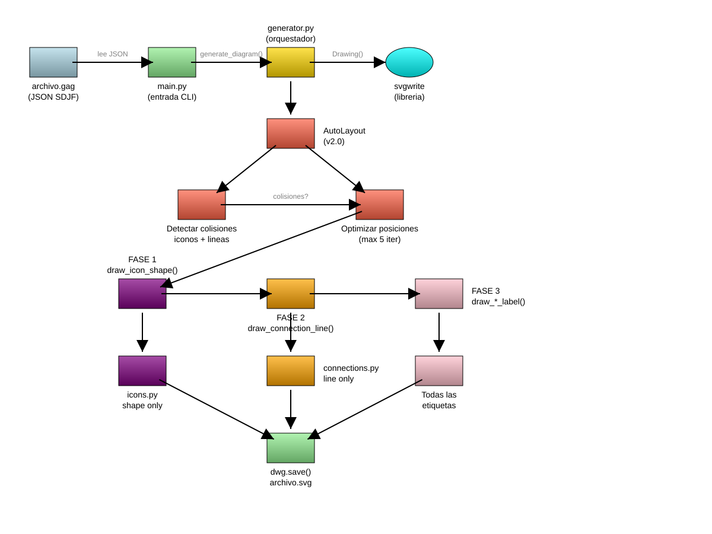
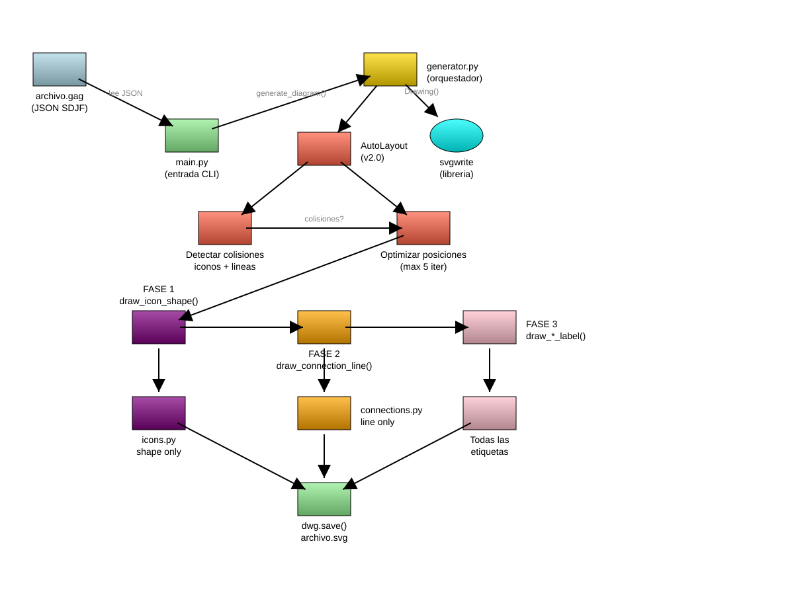
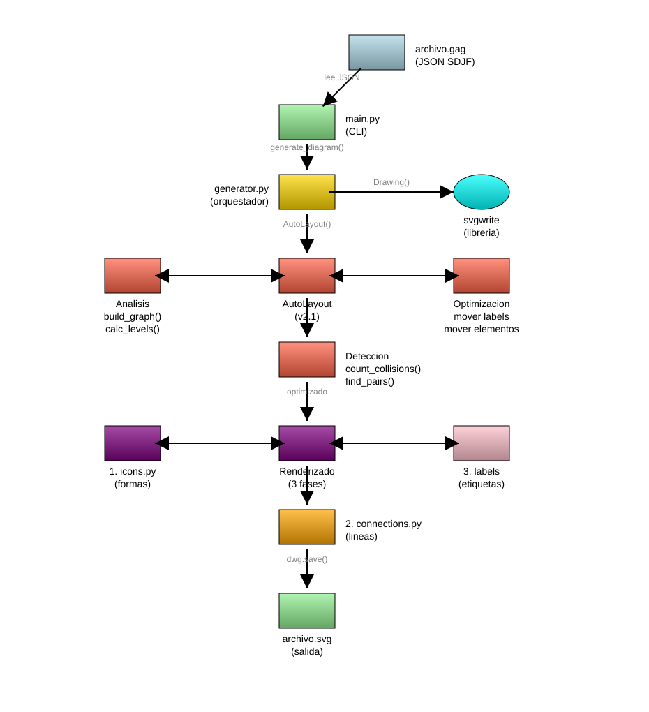

# Evolución de AutoLayout

Este documento rastrea la evolución del sistema AutoLayout de GAG, usando el diagrama de arquitectura (`05-arquitectura-gag.gag`) como benchmark.

---

## v1.0 - Sin AutoLayout

**Estado:** Las etiquetas se posicionaban siempre en `bottom` por defecto.

**Problemas:**
- Colisiones frecuentes entre etiquetas y otros elementos
- El usuario debía especificar `label_position` manualmente

---

## v1.4 - Detección de Colisiones Básica

**Características:**
- Detección de colisiones etiqueta vs ícono
- Detección de colisiones etiqueta vs línea de conexión
- Prueba posiciones en orden: `bottom` → `right` → `top` → `left`

**Limitaciones:**
- Solo mueve etiquetas, no elementos
- No considera la estructura del grafo

---

## v2.0 - Análisis de Grafo y Prioridades

**Fecha:** 2025-01-06

**Características nuevas:**
- Análisis de estructura del grafo (niveles, grupos, conexiones)
- Sistema de prioridades (high/normal/low) basado en número de conexiones
- Estrategia de optimización en 3 fases:
  1. Reubicar etiquetas
  2. Desplazar niveles completos
  3. Expandir canvas como último recurso

**Benchmark - Diagrama de Arquitectura:**



```
[WARN] AutoLayout v2.0: 2 colisiones no resueltas (inicial: 2)
     - 6 niveles, 1 grupo(s)
     - Prioridades: 0 high, 12 normal, 2 low
     - Canvas expandido a 1200x900
```

**Colisiones no resueltas:**
1. Línea diagonal `optimize → phase1` cruza la zona de `phase2`
2. Etiquetas que no encuentran posición libre

**Limitaciones identificadas:**
- No puede mover elementos, solo etiquetas
- No tiene routing inteligente de líneas
- Las líneas diagonales son problemáticas

---

## v2.1 - Movimiento Inteligente de Elementos

**Fecha:** 2025-01-06

**Características nuevas:**
- Identificación de pares en colisión (`_find_collision_pairs()`)
- Cálculo de espacio libre en cada dirección (`_find_free_space()`)
- Selección de elemento a mover por prioridad (`_select_element_to_move()`)
- Movimiento dinámico de elementos (`_calculate_move_direction()`)
- Expansión de canvas según necesidad (`_ensure_canvas_fits()`)

**Benchmark - Diagrama de Arquitectura:**



```
[WARN] AutoLayout v2.1: 1 colisiones no resueltas (inicial: 2)
     - 6 niveles, 1 grupo(s)
     - Prioridades: 0 high, 12 normal, 2 low
     - Canvas expandido a 1200x900
```

**Mejora:** De 2 colisiones (v2.0) a 1 colisión (v2.1)

**Colisión pendiente:**
- Línea diagonal que cruza zona de etiqueta (requiere routing de líneas)

### Rediseño del Diagrama de Arquitectura

**Fecha:** 2026-01-06

El diagrama original tenía problemas de claridad:
- Flechas confusas desde AutoLayout
- No mostraba dónde ocurre el análisis matemático
- Estructura horizontal poco intuitiva

**Nueva estructura vertical:**
```
archivo.gag (input)
    ↓
main.py (CLI)
    ↓
generator.py ──→ svgwrite
    ↓
AutoLayout v2.1 ←→ Analysis / Optimization
    ↓
Detection
    ↓
Renderizado ←→ icons.py / labels
    ↓
connections.py
    ↓
archivo.svg (output)
```



```
[WARN] AutoLayout v2.1: 2 colisiones no resueltas (inicial: 2)
     - 8 niveles, 1 grupo(s)
     - Prioridades: 2 high, 4 normal, 7 low
     - Canvas expandido a 930x1020
```

---

## v2.1 Refactorización - Arquitectura Modular

**Fecha:** 2026-01-07

**Motivación:**
La clase `AutoLayout` era monolítica (1117 líneas) mezclando:
- Almacenamiento de estructura (elements, connections)
- Análisis de grafos (niveles, grupos, prioridades)
- Cálculos geométricos (bounding boxes, intersecciones)
- Detección de colisiones
- Algoritmos de optimización

**Problema crítico:** El optimizador modificaba directamente `self.elements` durante optimización, imposibilitando ver el gradiente de optimización.

**Nueva arquitectura:**

```
Layout (datos inmutables)
  ↓
GeometryCalculator → CollisionDetector
  ↓                       ↓
GraphAnalyzer → AutoLayoutOptimizer
                  ↓
              generator.py
```

**Componentes creados:**

1. **layout/layout.py** (230 líneas)
   - Contenedor inmutable del estado del diagrama
   - Método `copy()` para crear candidatos independientes
   - Atributos de análisis escritos por optimizador

2. **layout/geometry.py** (330 líneas)
   - Extraído de autolayout.py (líneas 321-554)
   - Cálculos de bounding boxes e intersecciones
   - Stateless y reutilizable

3. **layout/graph_analysis.py** (180 líneas)
   - Extraído de autolayout.py (líneas 89-164)
   - Análisis de estructura: niveles, grupos, prioridades
   - Sistema de prioridades basado en conexiones

4. **layout/collision.py** (210 líneas)
   - Extraído de autolayout.py (líneas 556-701)
   - Detección de colisiones usando GeometryCalculator
   - Colisiones: ícono vs ícono, etiqueta vs ícono, etiqueta vs línea

5. **layout/optimizer_base.py** (100 líneas)
   - Interfaz abstracta `LayoutOptimizer`
   - Define contrato: `analyze()`, `evaluate()`, `optimize()`
   - Facilita agregar nuevos optimizadores

6. **layout/auto_optimizer.py** (600 líneas)
   - Implementación completa de AutoLayout v2.1
   - No modifica layout original, retorna nuevo layout optimizado
   - Optimización iterativa con candidatos independientes

**Nuevo flujo en generator.py:**

```python
# 1. Crear Layout inmutable
initial_layout = Layout(
    elements=all_elements,
    connections=all_connections,
    canvas={'width': canvas_width, 'height': canvas_height}
)

# 2. Instanciar optimizador
optimizer = AutoLayoutOptimizer(verbose=False)

# 3. Analizar para obtener info inicial
optimizer.analyze(initial_layout)
initial_collisions = optimizer.evaluate(initial_layout)

# 4. Optimizar (retorna NUEVO layout)
optimized_layout = optimizer.optimize(initial_layout, max_iterations=10)

# 5. Obtener resultados
elements = optimized_layout.elements
label_positions = optimized_layout.label_positions
conn_labels = optimized_layout.connection_labels
```

**Beneficios:**
- ✅ Separación de responsabilidades (Layout almacena, Optimizer procesa)
- ✅ Inmutabilidad permite ver gradiente de optimización
- ✅ Extensibilidad: fácil agregar nuevos optimizadores
- ✅ Testabilidad: cada componente es testeable independientemente
- ✅ Mantenibilidad: código más claro y comprensible

**Benchmark - Mantiene resultados de v2.1:**

```
[WARN] AutoLayout v2.1: 2 colisiones no resueltas (inicial: 2)
     - 8 niveles, 1 grupo(s)
     - Prioridades: 2 high, 4 normal, 7 low
[OK] Diagrama generado exitosamente: 05-arquitectura-gag.svg
```

**Estado:** Todos los ejemplos (`01-iconos-registrados.gag` a `05-arquitectura-gag.gag`) generan correctamente con la nueva arquitectura.

---

## v1.5 - Waypoints en Conexiones

**Fecha:** 2026-01-07

**Motivación:**
Las líneas rectas diagonales causan colisiones inevitables al cruzar elementos y etiquetas. En diagramas complejos como el de arquitectura, las líneas directas entre componentes generan múltiples colisiones que AutoLayout no puede resolver solo moviendo elementos o etiquetas.

**Problema identificado:**
```
[WARN] AutoLayout v2.1: 5 colisiones no resueltas (inicial: 4)
```

La mayoría de estas colisiones son causadas por líneas que cruzan elementos intermedios.

**Solución implementada - SDJF v1.5:**

Soporte de waypoints (puntos intermedios) en conexiones para routing manual:

```json
{
  "from": "optimizer",
  "to": "geometry",
  "waypoints": [
    {"x": 450, "y": 490},
    {"x": 300, "y": 490}
  ],
  "label": "usa",
  "direction": "forward"
}
```

**Implementación en draw/connections.py:**

- `draw_connection_line()` detecta presencia de waypoints
- Sin waypoints: `<line>` recta (compatibilidad retroactiva)
- Con waypoints: `<polyline>` pasando por todos los puntos
- Offsets visuales aplicados solo en primer y último segmento
- Flechas direccionales en extremos de la polyline

**Tipos de routing soportados:**

1. **Línea recta** (default): Sin waypoints
2. **Routing en L**: 1 waypoint formando ángulo recto
3. **Routing en U**: 2+ waypoints rodeando elementos
4. **Routing ortogonal**: Waypoints que forman solo líneas horizontales/verticales

**Ejemplo aplicado - 05-arquitectura-gag.gag:**

Agregados waypoints a 5 conexiones problemáticas:
- `optimizer → graph`: routing en L (evita collision detector)
- `optimizer → collision`: routing en L (evita graph analyzer)
- `collision → geometry`: routing en U (rodea todo el diagrama por abajo)
- `render → icons`: routing en L (evita connections)
- `render → labels`: routing en L (evita connections)

**Nuevo ejemplo - 06-waypoints.gag:**

Diagrama demostrativo con 4 elementos y centro evitado:
- Línea directa sin waypoints (cruza centro)
- Routing en U con 3 waypoints (rodea centro)
- Routing horizontal con 1 waypoint
- Comparación visual clara del antes/después

**Beneficios:**
- ✅ Reduce colisiones en diagramas complejos
- ✅ Mejora claridad visual con routing ortogonal
- ✅ Permite representar bucles y retroalimentación
- ✅ Compatible hacia atrás (conexiones sin waypoints funcionan igual)
- ✅ Formato SDJF extensible para futuras mejoras

**Limitaciones:**
- Waypoints son manuales (usuario debe especificarlos)
- No hay algoritmo automático de pathfinding (futuro v2.2+)

**SVG generado:**
```svg
<polyline points="140.0,457.0 140,450 640,450 640,150 640.0,157.0"
          marker-end="url(#arrow-end)"
          stroke="black" stroke-width="2" fill="none" />
```

---

## v4.0 - Auto Layout con Barycenter y Position Optimization

**Fecha:** 2026-02-17

**Motivación:**
El layout jerárquico v3.0 asignaba niveles topológicos pero no optimizaba el orden dentro de cada nivel ni minimizaba distancias de conectores. Esto producía cruces innecesarios y elementos apilados en diagramas con contenedores.

**Características nuevas:**

1. **Barycenter ordering** (Sugiyama-style): 2 iteraciones forward + 2 backward. Cada nodo se ordena por el promedio de posiciones X de sus vecinos en el nivel adyacente, con blend híbrido usando centrality scores.

2. **Position optimization**: Layer-offset bisection minimiza la distancia total ponderada de conectores. Forward + backward, max 10 iteraciones, convergencia < 0.001.

3. **Connection resolution**: `resolve_connections_to_primary()` resuelve endpoints contenidos a sus contenedores padre. Resultado: 20 edges resueltas en vez de 8 para el grafo de barycenter.

4. **Centrality scores**: `score = max(0, outdegree-1)*0.10 + max(0, indegree-1)*0.15`. Nodos con más conexiones se centran en su nivel.

5. **Escala X global**: Factor único calculado desde anchos de elementos para prevenir solapamientos.

6. **Fix de convergencia del optimizador**: Strategy C (canvas expansion) ya no resetea moved_elements ni llama a full _recalculate_structures.

7. **Fix de elementos apilados**: `recalculate_positions_with_expanded_containers()` ya no elimina posiciones de elementos libres.

**Benchmark - Diagrama de Arquitectura:**

```
Auto v4.0: 46 colisiones (vs 90 en v3.0)
  - 9 niveles topológicos
  - 0 elementos apilados (vs 8 en v3.0)
  - Convergencia estable (46 se mantiene en 46)
```

**Limpieza de código:**
- Eliminadas ~350 líneas de código muerto en auto_positioner.py
- Eliminado método `_select_element_to_move()` (reemplazado por `_select_element_to_move_weighted()`)
- Removidos 9 imports no utilizados

---

## v3.0 - LAF (Layout Abstracto Primero) — Sprints 1-11

**Fecha**: 2025-09 → 2026-02

**Cambio mayor**: introducción del sistema **LAF** como algoritmo alternativo a AUTO. Pipeline de 11 fases inspirado en Sugiyama/Graphviz que ignora coordenadas manuales y minimiza cruces topológicos.

Detalle de sprints (1-11) en `architecture/modules/layout/laf/PROGRESS.md`. Fases del pipeline:

| Fase | Responsable | Objetivo |
|---:|---|---|
| 1 | `structure_analyzer.py` | Árbol + grafo + niveles + scores + NdPr + TOI VCs |
| 2 | `optimizer.py` (viz) | Análisis topológico (visualización) |
| 3 | `optimizer.py` | Centrality ordering sobre NdPr |
| 4 | `abstract_placer.py` | Sugiyama barycenter |
| 5 | `position_optimizer.py` | Layer-offset bisection |
| 6 | `optimizer.py` | NdPr expansion |
| 7 | `visualizer.py` | Iterative summary |
| 8 | `inflator.py` + `container_grower.py` | Inflación + crecimiento |
| 9 | `optimizer.py` | Redistribución vertical |
| 10 | `routing_policy.py` → `router_manager.py` | Routing |
| 11 | `renderer.py` | SVG generation |

**Métricas clave** (sobre `05-arquitectura-gag`):
- Cruces de conectores: 15 (AUTO) → 2 (LAF) → **-87%**.
- Colisiones: 50 → 10 → **-80%**.
- Routing calls: 5+ → 1 → **-80%**.

---

## v3.3 - SDJF v2.1 + BUGS-DIAG-* (8 fixes visuales)

**Fecha**: 2026-06-15

**Objetivo**: pulir 8 problemas visuales en el set canonical de SVGs renderizados, documentados en `docs/DIAGRAM_REVIEW.md` con códigos `BUGS-DIAG-001..008`. Cubren temas como:
- Containers semi-transparentes ocultando hijos (DIAG-001).
- Labels gigantes descalibrando layout (DIAG-002, antecedente directo de WISH-LAYOUT-003).
- Bandas demasiado densas en el diagrama de arquitectura (DIAG-006).
- Grid spacing dentro de containers (DIAG-007).

Todos resueltos en este sprint.

---

## v3.4 - Ciclo "13 items en un sprint" (2026-06-18)

**Fecha**: 2026-06-18

**Objetivo**: cerrar deuda arquitectural acumulada + bugs funcionales pendientes. Backlog pasó de 13 BUGS funcionales + 6 WISH a **0 BUGS + 5 WISH** en una sola jornada.

### Resoluciones — refactores estructurales

**Tier 1 — `WISH-ARCH-001` + `WISH-ARCH-002`**: contrato `LayoutOptimizer` unificado.
- `LAFOptimizer` ahora hereda de `LayoutOptimizer` con `optimize()` polimórfica.
- `generator.py` usa factoría `OPTIMIZERS = {'auto':..., 'laf':...}` en vez de `if/elif`.
- Cada optimizer trae su renderer (`AutoSVGRenderer`, `LAFSVGRenderer`).
- Renderer compartido `AlmaGag/renderer.py` (509 líneas) **eliminado**; nuevo `AlmaGag/draw/svg.py` con primitivas agnósticas.
- `generator.py` **838 → 187 líneas (-77%)**.

**Tier 2 — `WISH-ARCH-003`**: reorganización por subdominio.
- `draw/` plano (16 archivos) → `draw/primitives/` (4) + `draw/icons/` (11 + dispatcher).
- `laf/visualizer.py` monolítico (2876 líneas) → paquete `laf/visualizer/` con 11 archivos (1 por fase) + class slim.

### Resoluciones — fixes funcionales

| Código | Resumen | Métrica clave |
|---|---|---|
| `BUGS-LAYOUT-003` | No-determinismo entre procesos Python | 7 puntos cerrados con `sorted()` + tie-break; 1 hash único en lugar de hasta 5. |
| `BUGS-LAYOUT-002` | Margen vertical excesivo en canvas LAF | Waste promedio 33% → 18%. |
| `BUGS-LAYOUT-001` | Etiquetas debug solapadas con elementos | 36/55 → 7/55 overlaps (los 7 restantes son falsos positivos). |
| `BUGS-LAF-002` | Layout pobre con dashboards | 4 zonas: canvas 5900×243 (24:1) → 1165×656 (1.8:1). Nueva Fase 1.5 dashboard reflow. |
| `BUGS-LAF-001` | Distribución horizontal asimétrica | 17/23 (74%) renders LAF perfectamente simétricos post-fix. |

### Resoluciones — features

`WISH-LAYOUT-003` — Auto-callout para labels grandes. Nuevo `draw/primitives/callout.py`; integración en ambos renderers. Umbrales conservadores (≥6 líneas / ≥150 chars) garantizan 0/23 canonicals afectados.

### Resoluciones — documentación

- `WISH-DOCS-001`: `architecture.mmd` benchmark sincronizado con el nuevo `.gag` (con 6 iconos custom).
- `WISH-DOCS-002` (esta entrada): `EVOLUTION.md` actualizado con el ciclo.
- `ARCHITECTURE.md` reescrito reflejando el estado post WISH-ARCH-001/002 + Fase 1.5 + factoría.

### Métricas globales del ciclo

| Métrica | Antes | Después |
|---|---:|---:|
| `generator.py` | 838 líneas | 187 líneas |
| `visualizer.py` archivo único | 2876 líneas | 11 archivos, max 862 |
| BUGS funcionales pendientes | 13 (5 LAYOUT/LAF + 8 DIAG) | 0 |
| WISH resueltos en ciclo | 0 | 6 (2 ARCH + 1 ARCH Tier2 + 1 LAYOUT + 2 DOCS) |
| Smoke render | 46/46 OK | 46/46 OK |
| Tests | 17 + 2 skipped | 19 passed |
| Determinismo (sin `--visualdebug`) | 1 hash único | 1 hash único |

### Diagrama de arquitectura

El `05-arquitectura-gag.svg` se regeneró con el nuevo `.gag` que contiene 6 iconos SVG custom (`factory`, `gear`, `brush`, `pipeline`, `contract`, `toolbox`) específicos para los roles arquitectónicos. Canvas final 2200×1520 con 3 colisiones detectadas.

---

## v3.5 - Ciclo "Norte semántico + audit visual" (2026-06-19..23)

**Fecha**: 2026-06-19 a 2026-06-23

**Objetivo**: cerrar el **norte estratégico** del proyecto (WISH-LAYOUT-004 — auto-detección semántica) y construir el sistema de regresión visual basado en las 3 reglas del usuario. En paralelo, depurar la cascada de 7 bugs en AUTO con containers que aparecieron al inspeccionar visualmente los canonicals.

### Resoluciones — features

**WISH-LAYOUT-004 (4 fases entregadas) — Auto-detección semántica de la distribución óptima**
- **Fase 1** (`ade4e41`): Framework + primer template `architecture` (T-shape).
- **Fase 2** (`1c5a95f`): `TemplateClassifier` + `GraphFeatures.extract(...)` + templates `flow`, `hub_and_spoke`. Clave del diseño: **inferencia** desde la estructura del grafo, no opt-in declarativo. El usuario solo escribe `"layout_template": "auto"` y el clasificador elige.
- **Fase 3** (`f587528`): Templates `dashboard`, `er`, `sequence`, `state` + calibración contra los 23 canonicals.
- **Fase 4** (`201931e`): Semantic hints (`role: entry|hub|spoke|...`) + sub-templates anidados (containers con su propio `layout_template`).

Métrica: 5 canonicals migrados a `layout_template: "auto"` con reducción promedio de canvas **−72%** (ver `e7d4714`).

**Validador de calidad visual (3 reglas R1/R2/R3)** (`3fb47f7`)
- Módulo `AlmaGag/validation/` con `validate_svg()` + `validate_gag()`.
- R1: labels NO sobre iconos. R2: labels NO solapados. R3: NO conectores sin endpoint.
- Audit aplicado al set canonical: 9 limpios, 15 con violations menores (165 total). Sirve como baseline para regresión visual continua.

### Resoluciones — fixes funcionales

**BUGS-AUTO-001..007** — cascada de 7 fixes en el pipeline AUTO con containers, descubiertos por inspección visual del usuario sobre `05-arquitectura-gag` y otros canonicals.

| Código | Causa raíz | Fix |
|---|---|---|
| BUGS-AUTO-001 | `label_positions` calculadas antes de mover icons por containers → labels huérfanas. | Re-cálculo de `current.label_positions` tras `recalculate_positions_with_expanded_containers`. |
| BUGS-AUTO-002 | Coords negativas (ej. backend-module a x=-93). | `_normalize_to_canvas` al final del optimize. |
| BUGS-AUTO-003 | `label_intersects_elements` contaba containers como obstáculos → labels desplazadas a posiciones malas. | `if 'contains' in elem: continue` en el detector. |
| BUGS-AUTO-004 | Containers solapados sin resolución. | `_resolve_container_overlaps` con cascada de empujones + `_shift_container_subtree`. |
| BUGS-AUTO-005 | Labels off-canvas / fuera de container. | Chequeos de bounds + `_label_inside_container` con header offset 40px. |
| BUGS-AUTO-006 | Labels bottom solapados horizontalmente en containers estrechos. | `_stagger_overlapping_contained_labels` escalonando en vertical + expandiendo container. |
| BUGS-AUTO-007 | Header del container se sale por la derecha (bold ~10px/char, no 8px). | `label_width × 1.25` en 3 funciones. |

### Resoluciones — refactores estructurales

**WISH-ARCH-003 — Reorganización de `draw/` + split de `visualizer.py`**
- `draw/` plano (16 archivos mezclados) → `draw/primitives/` (4 archivos: svg, connections, container, callout) + `draw/icons/` (11 archivos + dispatcher en `__init__.py`).
- `laf/visualizer.py` monolítico (2876 líneas) → paquete `laf/visualizer/` con 11 archivos, uno por fase.

**WISH-LAYOUT-003 — Auto-callout para labels grandes**
- Nuevo `draw/primitives/callout.py`. Umbrales conservadores (≥6 líneas o ≥150 chars). Aún no se dispara en ningún canonical (filtros conservadores intencional).

**WISH-LAYOUT-002 v1 — `constraints.align`**
- SDJF acepta `constraints: { align: [[id1, id2, ...]] }` para grupos co-alineados.

**WISH-LAF-001 v1 — Pesos dinámicos del barycenter**
- LAF Fase 4: barycenter ponderado por degree (más cruces de conexiones reducidos).

### Métricas globales del ciclo

| Métrica | Antes (v3.4) | Después (v3.5) |
|---|---:|---:|
| Templates de layout | 0 | 7 (+ nested + roles) |
| BUGS funcionales pendientes | 0 | 0 (7 nuevos abiertos+cerrados en el ciclo) |
| WISH resueltos en ciclo | 6 (v3.4) | 6 (4 LAYOUT + 1 ARCH + 1 LAF) |
| Tests | 19 | 70 (+51) |
| Validador visual | — | 3 reglas + audit canonical |
| Smoke render | 46/46 OK | 48/48 OK |
| Determinismo | 1 hash único | 1 hash único |

### Estado del norte estratégico

`WISH-LAYOUT-004` queda **cerrado en sus 4 fases entregadas**. Próximos posibles incrementos (no priorizados): templates adicionales (matrix, tree-of-life, kanban), refinamiento de la calibración con telemetría real, integración del validador R1/R2/R3 como gate en CI.

---

## Cómo usar este benchmark

Para probar cambios en AutoLayout:

```bash
# Regenerar el diagrama de arquitectura
almagag docs/examples/05-arquitectura-gag.gag
mv 05-arquitectura-gag.svg docs/examples/

# Comparar con versión anterior
# El objetivo es: 0 colisiones sin label_position hardcodeados
```

El diagrama `05-arquitectura-gag.gag` solo tiene coords manuales en los **containers padre** — los elementos contenidos se auto-acomodan dentro. Validado en v3.4 que LAF (con Fase 1.5 dashboard reflow) también lo maneja sin coords.

---

**Última actualización**: 2026-06-23 (v3.5 — WISH-LAYOUT-004 norte cerrado + validador 3 reglas).
