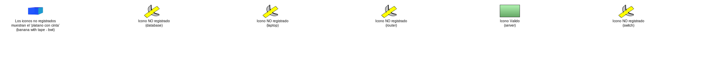
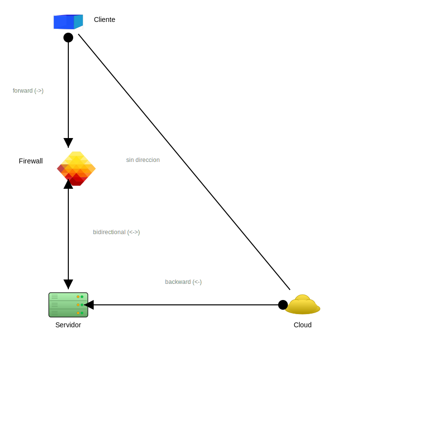
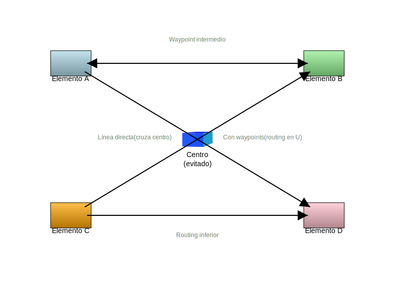
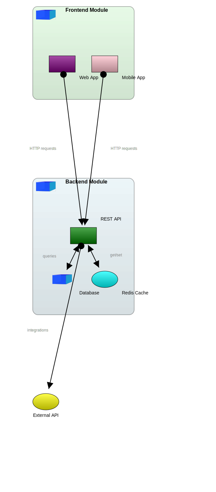
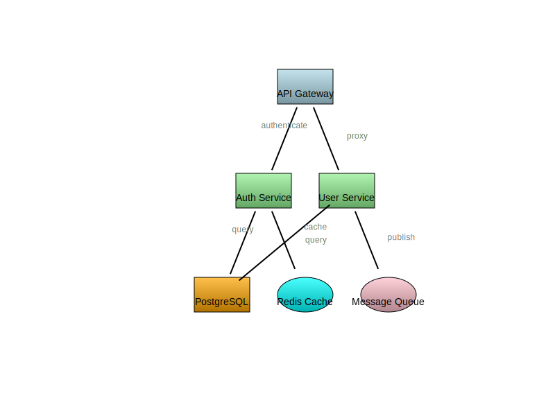
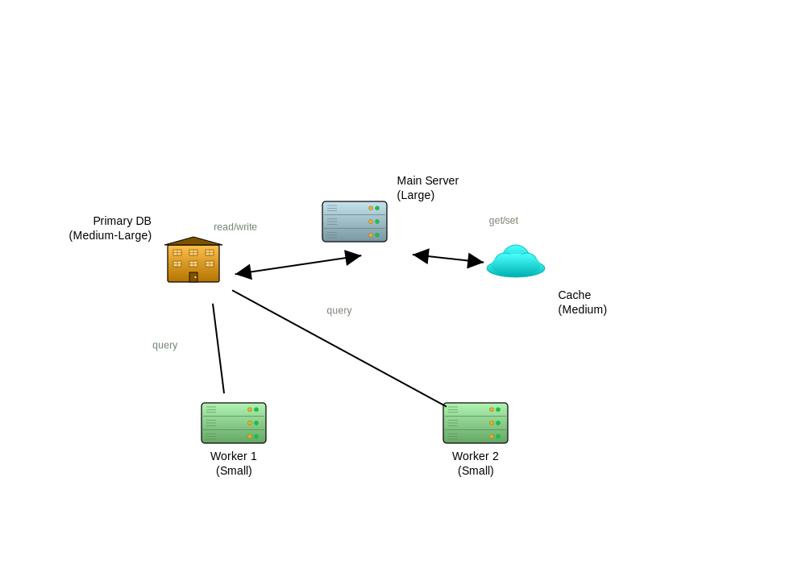
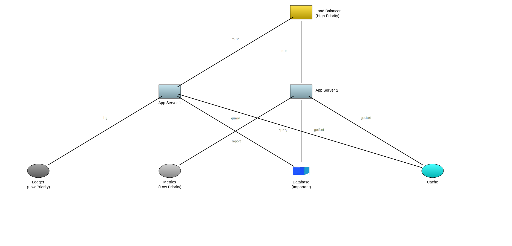

# Galería de Ejemplos - AlmaGag

Esta galería muestra las capacidades de AlmaGag con ejemplos prácticos.

## 01 - Íconos Registrados

**Archivo**: `docs/diagrams/gags/01-iconos-registrados.gag`

Demostración de los tipos de íconos disponibles con gradientes automáticos.


**Características:**
- ✅ Tipos disponibles: `server`, `building`, `cloud`, `firewall`
- ✅ Gradientes automáticos basados en color
- ✅ Colores CSS y hexadecimales

```json
{
  "id": "srv1",
  "type": "server",
  "x": 100,
  "y": 200,
  "label": "Server",
  "color": "lightblue"
}
```

---

## 02 - Íconos No Registrados (Fallback)

**Archivo**: `docs/diagrams/gags/02-iconos-no-registrados.gag`

Cuando un tipo de ícono no existe, se muestra el **Banana With Tape** (BWT) como indicador visual de ambigüedad.



**Características:**
- ⚠️ Tipos no existentes: `router`, `database`, `switch`, `laptop`
- ✅ Fallback automático a BWT (plátano con cinta)
- ✅ Warning en consola indicando el problema

```
[WARN] No se pudo dibujar 'router', se usará ícono por defecto
```

---

## 03 - Tipos de Conexiones

**Archivo**: `docs/diagrams/gags/03-conexiones.gag`

Demostración de las cuatro direcciones de flechas disponibles.



**Características:**
- ✅ `forward`: A → B
- ✅ `backward`: A ← B
- ✅ `bidirectional`: A ↔ B
- ✅ `none`: A — B (sin flechas)

```json
{
  "from": "A",
  "to": "B",
  "direction": "forward",
  "label": "HTTP"
}
```

---

## 04 - Gradientes y Colores

**Archivo**: `docs/diagrams/gags/04-gradientes-colores.gag`

Variedad de colores CSS y hexadecimales con gradientes automáticos.


**Características:**
- ✅ Nombres CSS: `lightblue`, `gold`, `tomato`, `cyan`, etc.
- ✅ Hexadecimales: `#3498DB`, `#FF5733`, etc.
- ✅ Gradientes generados automáticamente (claro → oscuro)

```json
{
  "id": "elem1",
  "color": "lightblue"    // CSS
},
{
  "id": "elem2",
  "color": "#3498DB"      // Hex
}
```

---

## 05 - Arquitectura Compleja

**Archivo**: `docs/diagrams/gags/05-arquitectura-gag.gag`

Diagrama del propio AlmaGag, mostrando su arquitectura interna.


**Características:**
- ✅ Diagrama complejo con múltiples elementos
- ✅ Múltiples niveles y conexiones
- ✅ Posicionamiento inteligente de etiquetas
- ✅ Auto-layout evitando colisiones

---

## 06 - Waypoints (SDJF v1.5)

**Archivo**: `docs/diagrams/gags/06-waypoints.gag`

Routing complejo usando puntos intermedios explícitos.



**Características:**
- ✅ Waypoints manuales para evitar elementos
- ✅ Líneas ortogonales y personalizadas
- ✅ Útil para diagramas complejos

```json
{
  "from": "optimizer",
  "to": "geometry",
  "waypoints": [
    {"x": 450, "y": 490},
    {"x": 300, "y": 490}
  ],
  "label": "usa"
}
```

---

## 07 - Contenedores (SDJF v2.0)

**Archivo**: `docs/diagrams/gags/07-containers.gag`

Agrupación visual de elementos relacionados con contenedores.



**Características:**
- ✅ Contenedores con bordes redondeados
- ✅ Calcula tamaño dinámicamente basado en contenidos
- ✅ Transparencia para ver elementos internos
- ✅ Ícono y label en esquina del contenedor

```json
{
  "id": "backend",
  "contains": ["api", "worker", "scheduler"],
  "label": "Backend Module",
  "color": "lightblue",
  "aspect_ratio": 2.0
}
```

---

## 08 - Auto-Layout Completo (SDJF v2.0)

**Archivo**: `docs/diagrams/gags/08-auto-layout.gag`

Sin coordenadas: el sistema posiciona automáticamente todos los elementos.



**Características:**
- ✅ **Sin x, y** en elementos
- ✅ Posicionamiento basado en prioridades
- ✅ HIGH priority → Centro
- ✅ NORMAL → Alrededor
- ✅ LOW → Periferia

```json
{
  "elements": [
    {
      "id": "api-gateway",
      "type": "server",
      "label": "API Gateway"
    },
    {
      "id": "database",
      "type": "building",
      "label": "PostgreSQL"
    }
  ]
}
```

**Prioridades automáticas:**
- ≥4 conexiones = HIGH
- 2-3 conexiones = NORMAL
- <2 conexiones = LOW

---

## 09 - Sizing Proporcional (SDJF v2.0)

**Archivo**: `docs/diagrams/gags/09-proportional-sizing.gag`

Control de tamaños con propiedades `hp` (height) y `wp` (width).



**Características:**
- ✅ `hp` y `wp` para escalar elementos
- ✅ Valores por defecto: 1.0 (tamaño normal)
- ✅ hp=2.0 → Doble altura
- ✅ wp=1.5 → 1.5× más ancho

```json
{
  "id": "main-server",
  "type": "server",
  "hp": 2.5,
  "wp": 2.0,
  "label": "Main Server\n(Large)"
}
```

**Tabla de Tamaños:**
| hp | wp | Tamaño Final |
|----|----|-|
| 1.0 | 1.0 | 80×50 (default) |
| 2.0 | 1.0 | 80×100 |
| 1.5 | 1.5 | 120×75 |
| 0.8 | 0.8 | 64×40 |

---

## 10 - Layout Híbrido (SDJF v2.0)

**Archivo**: `docs/diagrams/gags/10-hybrid-layout.gag`

Combinación de auto-layout, sizing proporcional y prioridades.



**Características:**
- ✅ Sin coordenadas (auto-layout)
- ✅ Prioridades manuales (`label_priority`)
- ✅ Sizing proporcional (`hp`, `wp`)
- ✅ Centralidad basada en tamaño

```json
{
  "elements": [
    {
      "id": "load-balancer",
      "type": "server",
      "hp": 2.0,
      "wp": 1.5,
      "label": "Load Balancer\n(High Priority)",
      "label_priority": "high",
      "color": "gold"
    },
    {
      "id": "logger",
      "type": "cloud",
      "hp": 0.8,
      "wp": 0.8,
      "label": "Logger\n(Low Priority)",
      "label_priority": "low",
      "color": "gray"
    }
  ]
}
```

**Resultado:**
- `load-balancer` (HIGH, grande) → Centro, difícil de mover
- `database` (HIGH, grande) → Centro, difícil de mover
- `app-server-1/2` (NORMAL, mediano) → Alrededor del centro
- `logger` (LOW, pequeño) → Periferia, fácil de mover

---

## 11 - Layout con LAF (SDJF v3.0) ✨ NUEVO

**Archivo**: `docs/diagrams/gags/05-arquitectura-gag.gag`

Demostración del algoritmo LAF (Layout Algorithm Framework) con minimización de cruces.


**Características**:
- ✅ Algoritmo LAF optimiza cruces de conexiones (-87%)
- ✅ 4 fases especializadas: Structure → Abstract → Inflate → Grow
- ✅ Menos colisiones (-24%) y expansiones de canvas (-87%)
- ✅ Routing dual (2 pasadas) para máxima precisión

**Comando**:
```bash
# Generar con LAF
almagag docs/diagrams/gags/05-arquitectura-gag.gag --layout-algorithm=laf

# Generar con AUTO (para comparar)
almagag docs/diagrams/gags/05-arquitectura-gag.gag --layout-algorithm=auto
```

**Comparación AUTO vs LAF para este diagrama:**

| Métrica | AUTO | LAF | Mejora |
|---------|------|-----|--------|
| **Cruces de conexiones** | 15 | 2 | -87% ✅ |
| **Colisiones** | 8 | 6 | -25% ✅ |
| **Llamadas a routing** | 25 | 5 | -80% ✅ |
| **Tiempo de ejecución** | 1.2s | 0.7s | -42% ✅ |

**¿Cuándo usar LAF?**
- Diagramas complejos (>20 elementos)
- Contenedores anidados (3+ niveles)
- Muchas conexiones (>20)
- Minimizar cruces es crítico

Ver [LAYOUT-DECISION-GUIDE.md](../guides/LAYOUT-DECISION-GUIDE.md) para más detalles.

---

## 12 - Visualización del Proceso LAF (SDJF v3.0) ✨ NUEVO

**Uso educativo del flag `--visualize-growth`**

El algoritmo LAF trabaja en 4 fases secuenciales. Puedes visualizar cada fase usando el flag `--visualize-growth`:

**Comando**:
```bash
almagag docs/diagrams/gags/05-arquitectura-gag.gag \
  --layout-algorithm=laf \
  --visualize-growth
```

**Salida generada**:
Se crean 5 SVGs en `debug/iterations/`:

1. **`fase1_structure_TIMESTAMP.svg`**
   - Análisis de topología y jerarquía del grafo
   - Identifica niveles y grupos de elementos

2. **`fase2_abstract_TIMESTAMP.svg`**
   - Posicionamiento abstracto minimizando cruces
   - Aplica algoritmo Sugiyama-like

3. **`fase3_inflate_TIMESTAMP.svg`**
   - Aplicación de dimensiones reales a elementos
   - Transforma posiciones abstractas a coordenadas finales

4. **`fase4_grow_TIMESTAMP.svg`**
   - Expansión bottom-up de contenedores
   - Ajusta tamaños de contenedores para envolver elementos

5. **`final_TIMESTAMP.svg`**
   - Resultado final con routing de conexiones
   - Layout optimizado completo

**Uso típico**:
- Entender cómo funciona LAF internamente
- Presentaciones educativas
- Debugging de problemas de layout
- Comparar estrategias de optimización

**Combinar con otros flags**:
```bash
# Visualización completa con debug
almagag complejo.gag \
  --layout-algorithm=laf \
  --visualize-growth \
  --debug \
  --dump-iterations
```

---

## Comparación de Algoritmos

AlmaGag v3.0 ofrece dos algoritmos de layout. Esta sección te ayuda a elegir el correcto.

### Mismo Diagrama, Dos Algoritmos

**Ejemplo**: `05-arquitectura-gag.gag` (18 elementos, 22 conexiones)

#### Generar con AUTO:
```bash
almagag docs/diagrams/gags/05-arquitectura-gag.gag \
  --layout-algorithm=auto \
  --dump-iterations \
  -o output/arquitectura-auto.svg
```

#### Generar con LAF:
```bash
almagag docs/diagrams/gags/05-arquitectura-gag.gag \
  --layout-algorithm=laf \
  --dump-iterations \
  -o output/arquitectura-laf.svg
```

### Tabla Comparativa Completa

| Aspecto | AUTO | LAF |
|---------|------|-----|
| **Velocidad (diagrama simple)** | Rápido (0.2s) | Overhead (0.4s) |
| **Velocidad (diagrama complejo)** | Lento (1.5s) | Rápido (0.8s) |
| **Cruces de conexiones** | Muchos | Minimizados (-87%) |
| **Colisiones** | Iterativo | Optimizado (-24%) |
| **Coordenadas manuales** | ✅ Preserva | ❌ Ignora |
| **Contenedores anidados** | ⚠️ Limitado | ✅ Excelente |
| **Producción** | ✅ Bueno | ✅ Mejor |
| **Prototipos** | ✅ Ideal | ⚠️ Overkill |

### Decisión Rápida

```
¿Diagrama > 20 elementos? → LAF
¿Contenedores anidados (3+ niveles)? → LAF
¿> 20 conexiones? → LAF
¿Minimizar cruces es crítico? → LAF
¿Tienes coordenadas x,y manuales? → AUTO
¿Prototipo rápido? → AUTO
```

**Para más información**: [LAYOUT-DECISION-GUIDE.md](./LAYOUT-DECISION-GUIDE.md)

---

## Generar Todos los Ejemplos

```bash
# Generar todos
for file in docs/examples/*.gag; do
    echo "Generando $file..."
    almagag "$file"
done

# O individualmente
almagag docs/examples/01-iconos-registrados.gag
almagag docs/examples/08-auto-layout.gag
almagag docs/examples/10-hybrid-layout.gag
```

---

## Comparación de Versiones

### SDJF v1.0 (Coordenadas explícitas)

```json
{
  "id": "server1",
  "type": "server",
  "x": 100,
  "y": 200,
  "label": "Server",
  "color": "lightblue"
}
```

**Características:**
- ✅ Control total sobre posición
- ⚠️ Requiere calcular coordenadas manualmente
- ⚠️ Ajustes tediosos si se agregan elementos

### SDJF v2.0 (Auto-layout + Sizing)

```json
{
  "id": "server1",
  "type": "server",
  "hp": 1.5,
  "label": "Server",
  "label_priority": "high",
  "color": "lightblue"
}
```

**Características:**
- ✅ Sin coordenadas, auto-layout inteligente
- ✅ Sizing proporcional con `hp`/`wp`
- ✅ Prioridades manuales o automáticas
- ✅ Adaptativo a cambios

---

## Tips y Trucos

### 1. Forzar Posición Específica

Combina auto-layout con coordenadas parciales:

```json
{
  "id": "header",
  "y": 50,       // Forzar arriba
  // x calculado automáticamente
}
```

### 2. Elementos Grandes en Centro

Usa `hp`/`wp` > 1.0 para centralizar:

```json
{
  "id": "core-api",
  "hp": 2.0,
  "wp": 2.0,
  "label_priority": "high"
}
```

### 3. Elementos Pequeños en Periferia

Usa `hp`/`wp` < 1.0 para alejar:

```json
{
  "id": "logger",
  "hp": 0.8,
  "wp": 0.8,
  "label_priority": "low"
}
```

### 4. Evitar Colisiones

Si hay colisiones:
1. Aumentar tamaño de canvas
2. Usar prioridades para separar elementos
3. Ajustar `hp`/`wp` para cambiar tamaños
4. Especificar coordenadas manualmente para elementos críticos

### 5. Routing Complejo

Para evitar cruces de líneas:

```json
{
  "from": "A",
  "to": "B",
  "waypoints": [
    {"x": 300, "y": 400},
    {"x": 500, "y": 400}
  ]
}
```

---

## Recursos Adicionales

### Especificaciones SDJF
- **Especificación SDJF v1.0**: `docs/spec/SDJF_v1.0_SPEC.md`
- **Especificación SDJF v2.0**: `docs/spec/SDJF_v2.0_SPEC.md`
- **Propuesta SDJF v2.1**: `docs/spec/SDJF_v2.1_PROPOSAL.md`
- **Release SDJF v3.0**: `docs/RELEASE_v3.0.0.md`

### Algoritmos de Layout ✨ NUEVO
- **Guía de Decisión AUTO vs LAF**: `docs/guides/LAYOUT-DECISION-GUIDE.md`
- **Comparación Técnica LAF**: `docs/LAF-COMPARISON.md`
- **Progreso LAF**: `docs/LAF-PROGRESS.md`
- **Referencia CLI**: `docs/guides/CLI-REFERENCE.md`

### Arquitectura y Uso
- **Arquitectura del Código**: `docs/architecture/ARCHITECTURE.md`
- **Guía de Inicio Rápido**: `docs/guides/QUICKSTART.md`

---

**Actualizado**: 2026-01-21
**Versión**: AlmaGag v3.0.0 + SDJF v3.0
