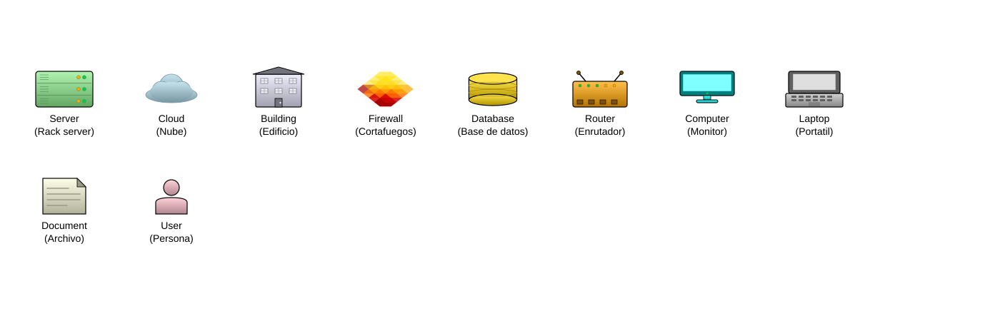
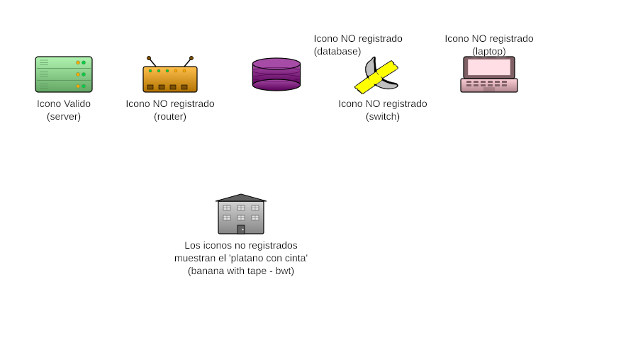
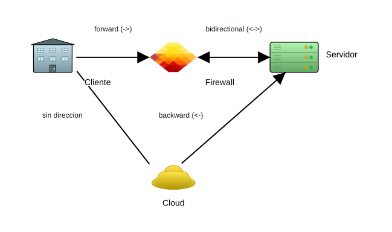
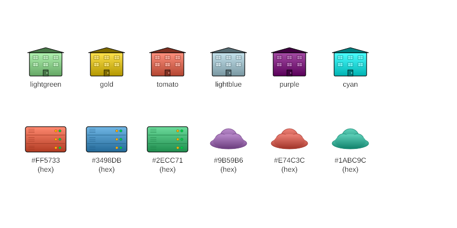
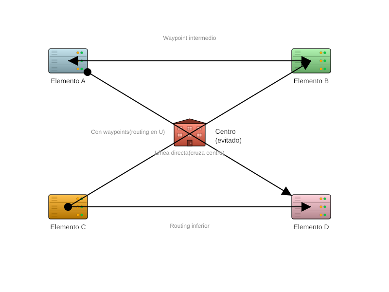
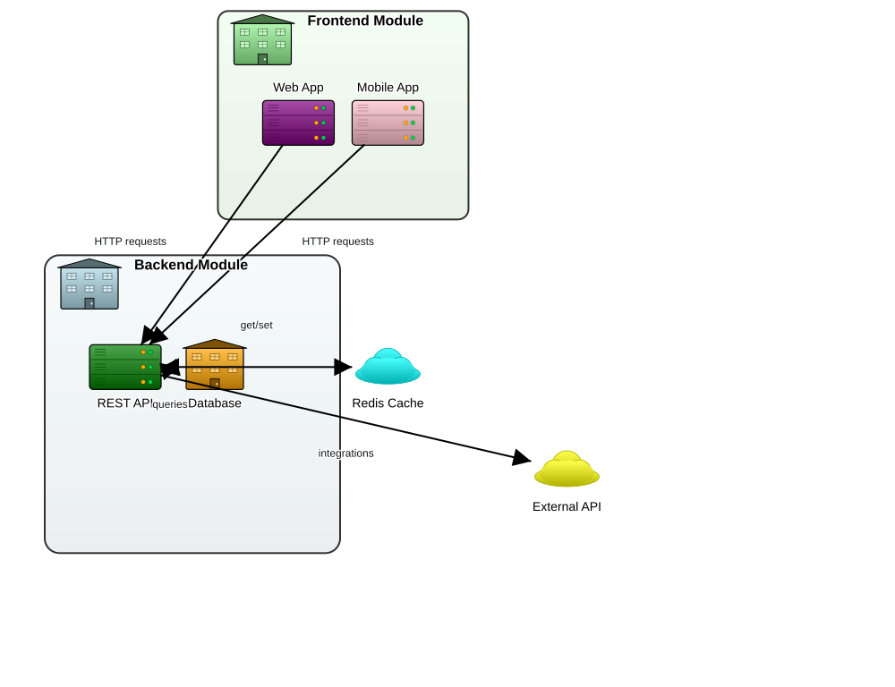
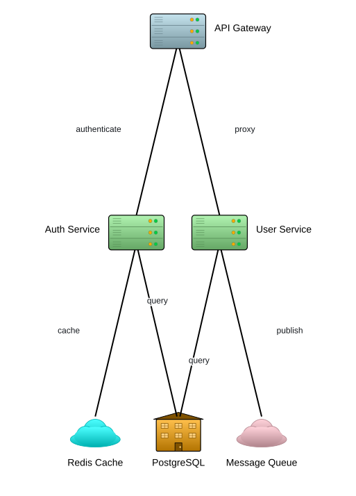
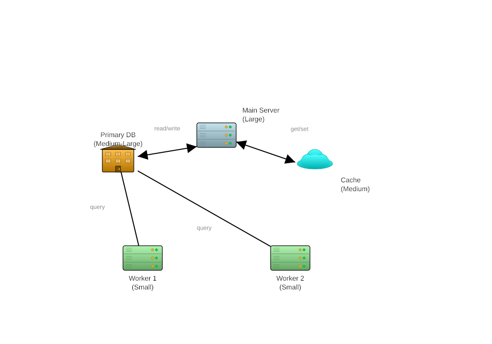
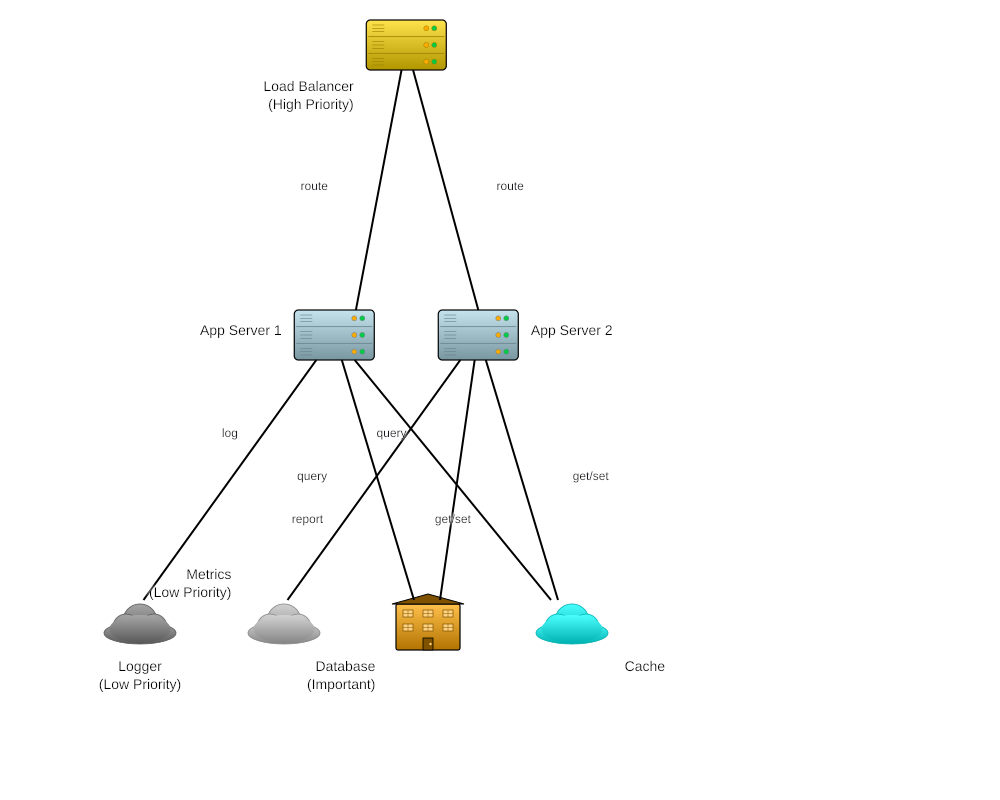

# Galería de Ejemplos - AlmaGag

Esta galería muestra las capacidades de AlmaGag con ejemplos prácticos.

## 01 - Íconos Registrados

**Archivo**: `docs/diagrams/gags/01-iconos-registrados.sdjf`

Demostración de los tipos de íconos disponibles con gradientes automáticos.



**Características:**
- ✅ 10 de los 13 tipos built-in: `server`, `cloud`, `building`, `firewall`, `database`, `router`, `computer`, `laptop`, `document`, `user`
- ✅ Gradientes automáticos basados en color
- ✅ Colores CSS y hexadecimales

```json
{
  "id": "srv1",
  "type": "server",
  "x": 100,
  "y": 200,
  "label": "Server",
  "color": "lightblue"
}
```

---

## 02 - Íconos No Registrados (Fallback)

**Archivo**: `docs/diagrams/gags/02-iconos-no-registrados.sdjf`

Cuando un tipo de ícono no existe, se muestra el **Banana With Tape** (BWT) como indicador visual de ambigüedad.



**Características:**
- ⚠️ Tipo sin icono en el fixture: `switch` (los demás — `router`, `database`, `laptop` — ya son built-in)
- ✅ Fallback automático a BWT (plátano con cinta) **rotulado con el nombre del type** (§Q64)
- ✅ WARNING §O55 en consola + inventario `§Q64: N type(s) en BWT`

```
WARNING §O55: type 'switch' sin icono registrado — se dibuja el BWT por defecto
```

---

## 03 - Tipos de Conexiones

**Archivo**: `docs/diagrams/gags/03-conexiones.sdjf`

Demostración de las cuatro direcciones de flechas disponibles.



**Características:**
- ✅ `forward`: A → B
- ✅ `backward`: A ← B
- ✅ `bidirectional`: A ↔ B
- ✅ `none`: A — B (sin flechas)

```json
{
  "from": "A",
  "to": "B",
  "direction": "forward",
  "label": "HTTP"
}
```

---

## 04 - Gradientes y Colores

**Archivo**: `docs/diagrams/gags/04-gradientes-colores.sdjf`

Variedad de colores CSS y hexadecimales con gradientes automáticos.



**Características:**
- ✅ Nombres CSS: `lightblue`, `gold`, `tomato`, `cyan`, etc.
- ✅ Hexadecimales: `#3498DB`, `#FF5733`, etc.
- ✅ Gradientes generados automáticamente (claro → oscuro)

```json
{
  "id": "elem1",
  "color": "lightblue"    // CSS
},
{
  "id": "elem2",
  "color": "#3498DB"      // Hex
}
```

---

## 05 - Arquitectura Compleja

**Archivo**: `docs/diagrams/gags/05-arquitectura-gag.gag`

Diagrama del propio AlmaGag, mostrando su arquitectura interna.


**Características:**
- ✅ Diagrama complejo con múltiples elementos
- ✅ Múltiples niveles y conexiones
- ✅ Posicionamiento inteligente de etiquetas
- ✅ Auto-layout evitando colisiones

---

## 06 - Waypoints (SDJF v1.5)

**Archivo**: `docs/diagrams/gags/06-waypoints.sdjf`

Routing complejo usando puntos intermedios explícitos.



**Características:**
- ✅ Waypoints manuales para evitar elementos
- ✅ Líneas ortogonales y personalizadas
- ✅ Útil para diagramas complejos

```json
{
  "from": "optimizer",
  "to": "geometry",
  "waypoints": [
    {"x": 450, "y": 490},
    {"x": 300, "y": 490}
  ],
  "label": "usa"
}
```

---

## 07 - Contenedores (SDJF v2.0)

**Archivo**: `docs/diagrams/gags/07-containers.sdjf`

Agrupación visual de elementos relacionados con contenedores.



**Características:**
- ✅ Contenedores con bordes redondeados
- ✅ Calcula tamaño dinámicamente basado en contenidos
- ✅ Transparencia para ver elementos internos
- ✅ Ícono y label en esquina del contenedor

```json
{
  "id": "backend",
  "contains": ["api", "worker", "scheduler"],
  "label": "Backend Module",
  "color": "lightblue",
  "aspect_ratio": 2.0
}
```

---

## 08 - Auto-Layout Completo (SDJF v2.0)

**Archivo**: `docs/diagrams/gags/08-auto-layout.sdjf`

Sin coordenadas: el sistema posiciona automáticamente todos los elementos.



**Características:**
- ✅ **Sin x, y** en elementos
- ✅ Posicionamiento basado en prioridades
- ✅ HIGH priority → Centro
- ✅ NORMAL → Alrededor
- ✅ LOW → Periferia

```json
{
  "elements": [
    {
      "id": "api-gateway",
      "type": "server",
      "label": "API Gateway"
    },
    {
      "id": "database",
      "type": "building",
      "label": "PostgreSQL"
    }
  ]
}
```

**Prioridades automáticas:**
- ≥4 conexiones = HIGH
- 2-3 conexiones = NORMAL
- <2 conexiones = LOW

---

## 09 - Sizing Proporcional (SDJF v2.0)

**Archivo**: `docs/diagrams/gags/09-proportional-sizing.sdjf`

Control de tamaños con propiedades `hp` (height) y `wp` (width).



**Características:**
- ✅ `hp` y `wp` para escalar elementos
- ✅ Valores por defecto: 1.0 (tamaño normal)
- ✅ hp=2.0 → Doble altura
- ✅ wp=1.5 → 1.5× más ancho

```json
{
  "id": "main-server",
  "type": "server",
  "hp": 2.5,
  "wp": 2.0,
  "label": "Main Server\n(Large)"
}
```

**Tabla de Tamaños:**
| hp | wp | Tamaño Final |
|----|----|-|
| 1.0 | 1.0 | 80×50 (default) |
| 2.0 | 1.0 | 80×100 |
| 1.5 | 1.5 | 120×75 |
| 0.8 | 0.8 | 64×40 |

---

## 10 - Layout Híbrido (SDJF v2.0)

**Archivo**: `docs/diagrams/gags/10-hybrid-layout.sdjf`

Combinación de auto-layout, sizing proporcional y prioridades.



**Características:**
- ✅ Sin coordenadas (auto-layout)
- ✅ Prioridades manuales (`label_priority`)
- ✅ Sizing proporcional (`hp`, `wp`)
- ✅ Centralidad basada en tamaño

```json
{
  "elements": [
    {
      "id": "load-balancer",
      "type": "server",
      "hp": 2.0,
      "wp": 1.5,
      "label": "Load Balancer\n(High Priority)",
      "label_priority": "high",
      "color": "gold"
    },
    {
      "id": "logger",
      "type": "cloud",
      "hp": 0.8,
      "wp": 0.8,
      "label": "Logger\n(Low Priority)",
      "label_priority": "low",
      "color": "gray"
    }
  ]
}
```

**Resultado:**
- `load-balancer` (HIGH, grande) → Centro, difícil de mover
- `database` (HIGH, grande) → Centro, difícil de mover
- `app-server-1/2` (NORMAL, mediano) → Alrededor del centro
- `logger` (LOW, pequeño) → Periferia, fácil de mover

---

## 11 - Estrategias del motor (histórico: LAF → `legacy`)

**Archivo**: `docs/diagrams/gags/05-arquitectura-gag.gag`

El antiguo algoritmo LAF vive congelado como estrategia `legacy` y **nunca
se auto-elige**; el motor (`select`) decide entre `auto` y `hier` desde el
JSON. Forzar una estrategia es territorio de debug:

```bash
# Uso normal: el motor elige
almagag docs/diagrams/gags/05-arquitectura-gag.gag

# Forzar una estrategia (debug)
almagag docs/diagrams/gags/05-arquitectura-gag.gag --layout-algorithm=auto
```

## 12 - Epifanía: visualizar el proceso del motor

**Flag `--epifania`** (alias históricos: `--debug-phases`, `--visualize-growth`)

La Epifanía genera un SVG por FASE del pipeline (agnóstica del motor desde
§ii-b) en `debug/epifania/<diagrama>/` + un `index.html` tipo flipbook, con
las colisiones marcadas en cada foto:

```bash
almagag docs/diagrams/gags/05-arquitectura-gag.gag --epifania
```

Fases típicas del motor `auto`: posicionamiento (barycenter + contenedores
+ ruteo inicial) → contenedores (dimensiones + centrado) → zonas
(near §N46 / banda-periferia §P60) → compactación → iteraciones →
re-ruteo final → final. Es la herramienta para responder «¿por qué salió
así?».

## ¿Qué estrategia va a elegir el motor?

Ya no se comparan algoritmos: el default `select` decide desde el JSON.
Reglas (en orden; la primera que aplica gana, con WARNING §O53 si una señal
anula a otra):

```
1. --view ≠ auto   → hier      5. decision/diamond → hier
2. considerations  → auto      6. ciclo sin x/y    → hier
3. contains        → auto      7. resto            → auto
4. areas           → hier
```

**Para más información**: [LAYOUT-DECISION-GUIDE.md](./LAYOUT-DECISION-GUIDE.md)

---

## Generar Todos los Ejemplos

```bash
# Generar todos
for file in docs/diagrams/gags/*.sdjf docs/diagrams/gags/*.gag; do
    echo "Generando $file..."
    almagag "$file"
done

# O individualmente
almagag docs/diagrams/gags/01-iconos-registrados.sdjf
almagag docs/diagrams/gags/08-auto-layout.sdjf
almagag docs/diagrams/gags/10-hybrid-layout.sdjf
```

---

## Comparación de Versiones

### SDJF v1.0 (Coordenadas explícitas)

```json
{
  "id": "server1",
  "type": "server",
  "x": 100,
  "y": 200,
  "label": "Server",
  "color": "lightblue"
}
```

**Características:**
- ✅ Control total sobre posición
- ⚠️ Requiere calcular coordenadas manualmente
- ⚠️ Ajustes tediosos si se agregan elementos

### SDJF v2.0 (Auto-layout + Sizing)

```json
{
  "id": "server1",
  "type": "server",
  "hp": 1.5,
  "label": "Server",
  "label_priority": "high",
  "color": "lightblue"
}
```

**Características:**
- ✅ Sin coordenadas, auto-layout inteligente
- ✅ Sizing proporcional con `hp`/`wp`
- ✅ Prioridades manuales o automáticas
- ✅ Adaptativo a cambios

---

## Tips y Trucos

### 1. Forzar Posición Específica

Combina auto-layout con coordenadas parciales:

```json
{
  "id": "header",
  "y": 50,       // Forzar arriba
  // x calculado automáticamente
}
```

### 2. Elementos Grandes en Centro

Usa `hp`/`wp` > 1.0 para centralizar:

```json
{
  "id": "core-api",
  "hp": 2.0,
  "wp": 2.0,
  "label_priority": "high"
}
```

### 3. Elementos Pequeños en Periferia

Usa `hp`/`wp` < 1.0 para alejar:

```json
{
  "id": "logger",
  "hp": 0.8,
  "wp": 0.8,
  "label_priority": "low"
}
```

### 4. Evitar Colisiones

Si hay colisiones:
1. Aumentar tamaño de canvas
2. Usar prioridades para separar elementos
3. Ajustar `hp`/`wp` para cambiar tamaños
4. Especificar coordenadas manualmente para elementos críticos

### 5. Routing Complejo

Para evitar cruces de líneas:

```json
{
  "from": "A",
  "to": "B",
  "waypoints": [
    {"x": 300, "y": 400},
    {"x": 500, "y": 400}
  ]
}
```

---

## Recursos Adicionales

### Especificaciones SDJF
- **Especificación SDJF v1.0**: `docs/spec/SDJF_v1.0_SPEC.md`
- **Especificación SDJF v2.0**: `docs/spec/SDJF_v2.0_SPEC.md`
- **Propuesta SDJF v2.1**: `docs/spec/SDJF_v2.1_PROPOSAL.md`
- **Release SDJF v3.0**: `docs/RELEASE_v3.0.0.md`

### Algoritmos de Layout ✨ NUEVO
- **Cómo decide el motor**: `docs/guides/LAYOUT-DECISION-GUIDE.md`
- **Referencia CLI**: `docs/guides/CLI-REFERENCE.md`

### Arquitectura y Uso
- **Arquitectura del Código**: `docs/architecture/ARCHITECTURE.md`
- **Guía de Inicio Rápido**: `docs/guides/QUICKSTART.md`

---

**Actualizado**: 2026-08-02
**Versión**: AlmaGag v3.5.0
